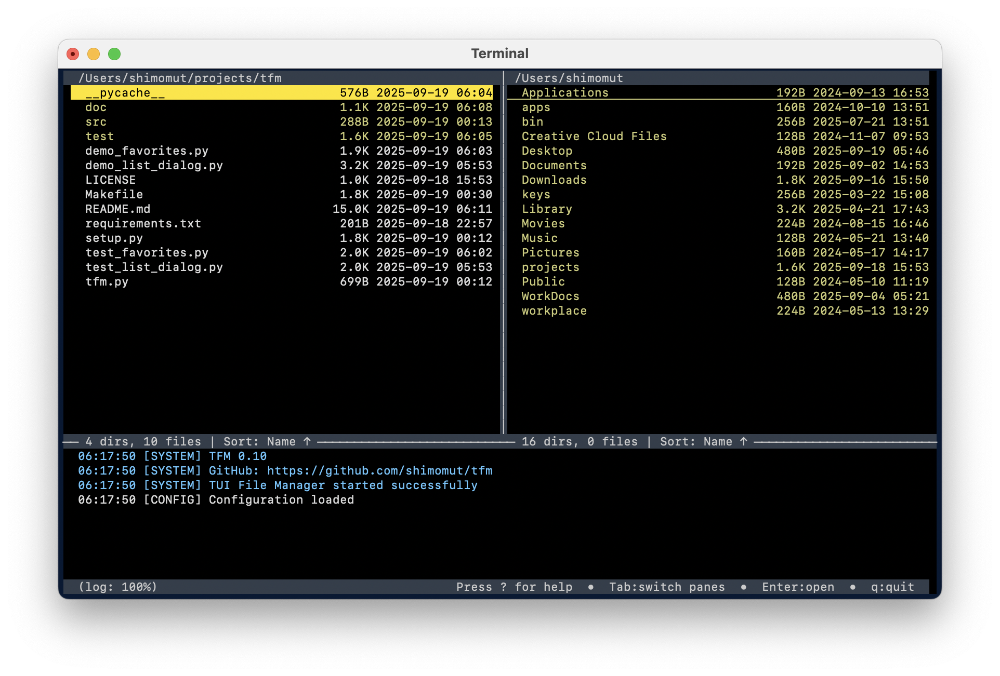
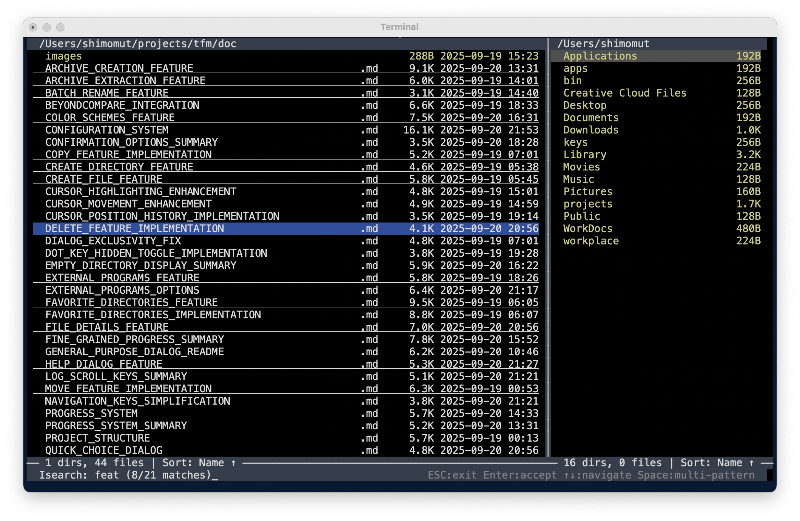
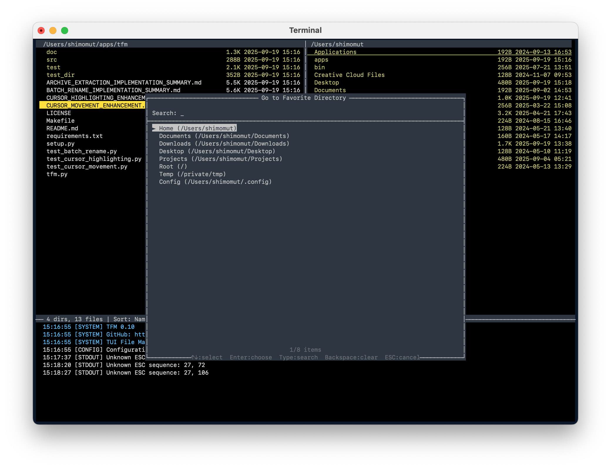
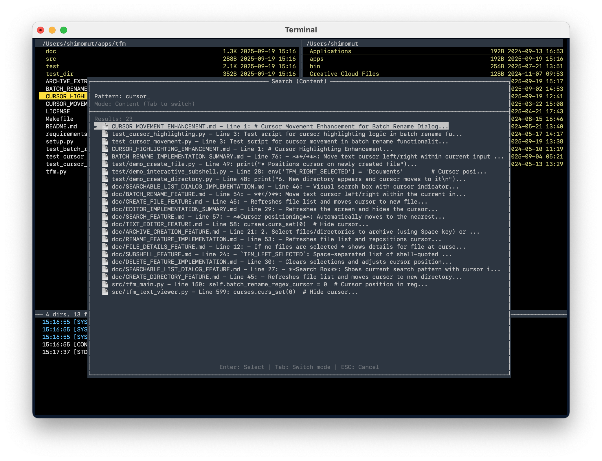
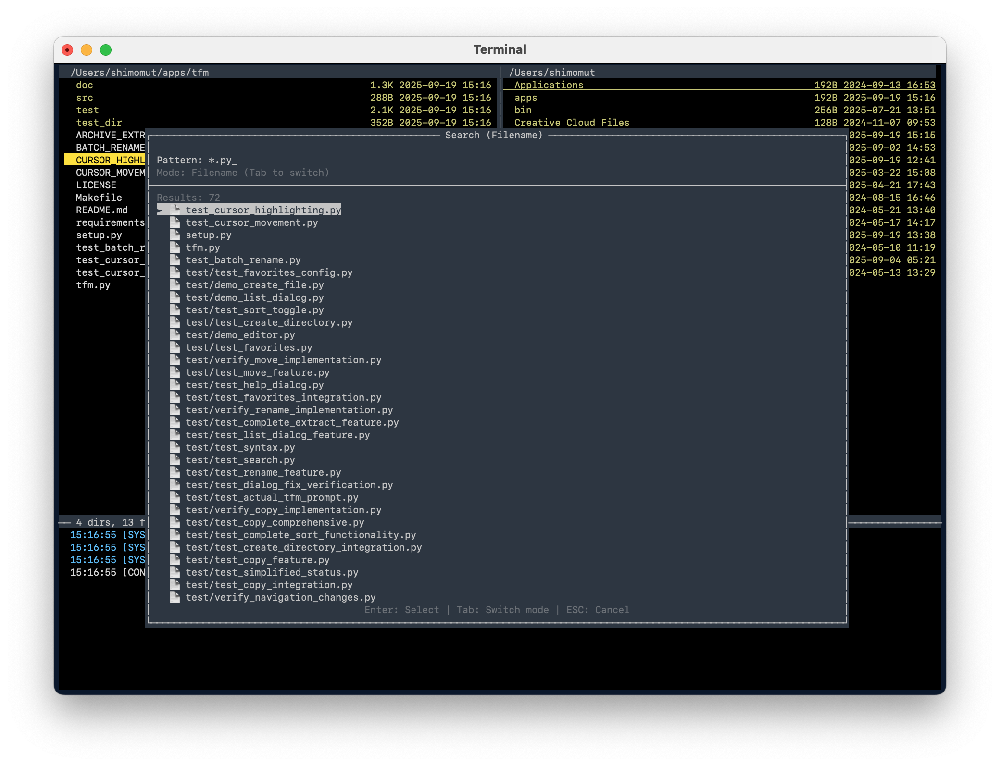
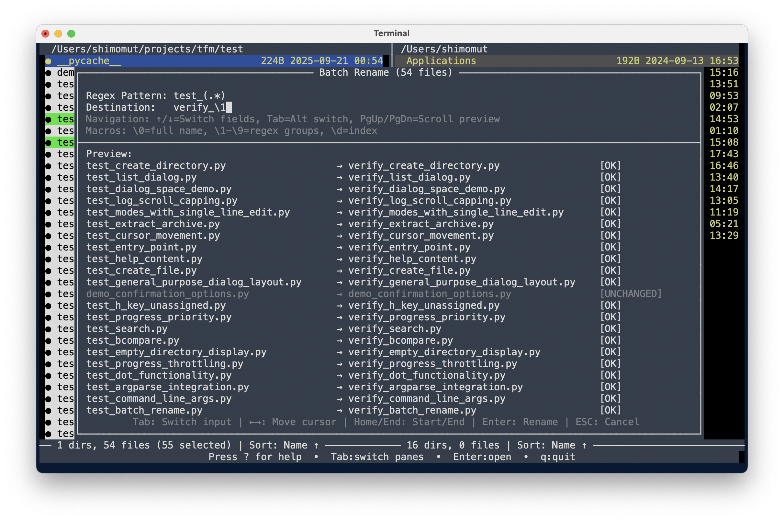
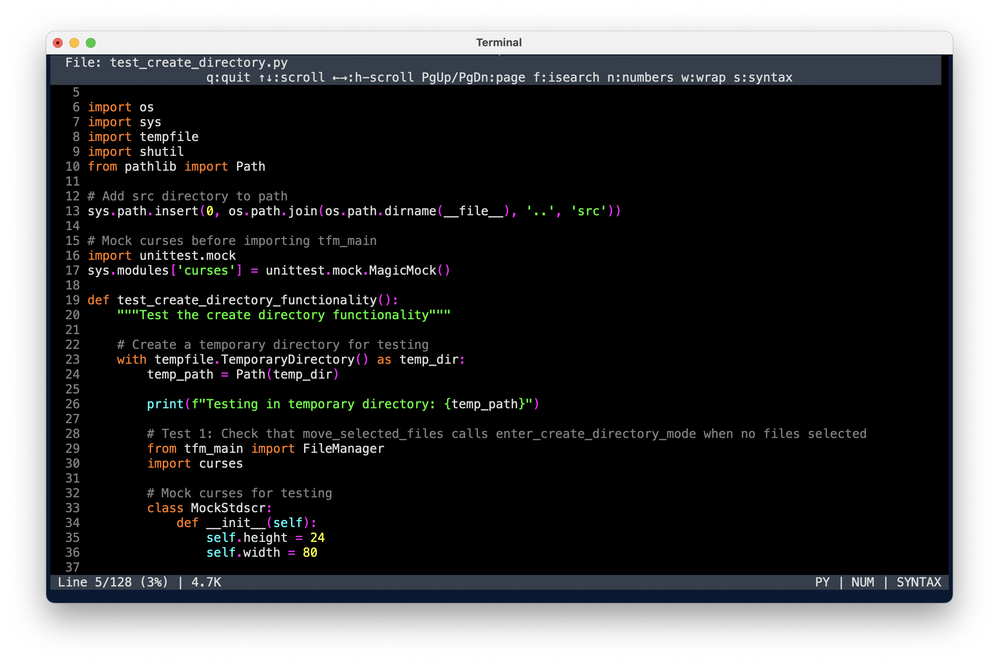
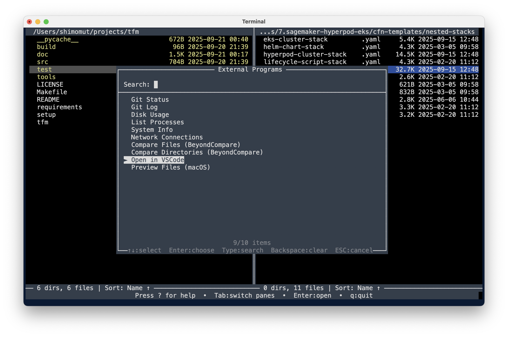
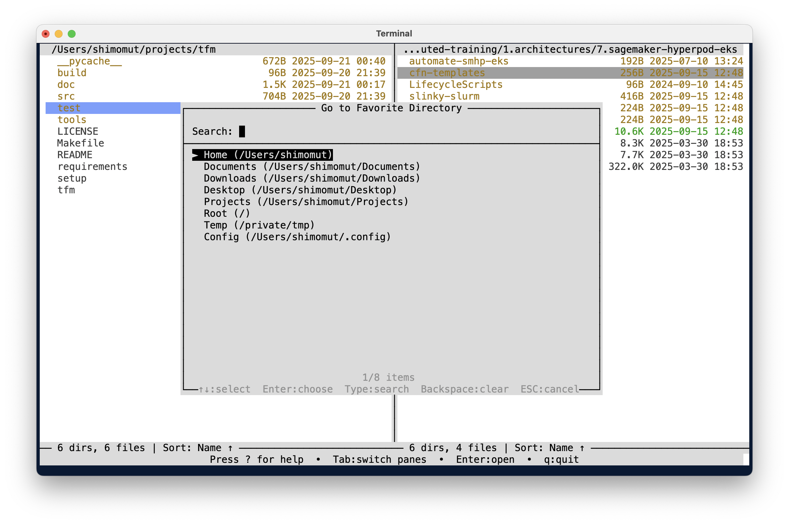

# TFM - TUI File Manager

A powerful file manager that runs both in the terminal and as a native desktop application. Navigate your filesystem with keyboard shortcuts in a clean, intuitive dual-pane interface with comprehensive file operations, advanced text editing, and professional-grade features.

**Run in Terminal Mode** (all platforms) or **Desktop Mode** (macOS native app with GPU acceleration).

## Key Features

- **Dual-pane interface** with independent navigation and cross-pane operations
- **Archive browsing** - Navigate ZIP, TAR, and compressed archives as virtual directories
- **SFTP support** - Browse and manage remote servers via SSH with optimized performance
- **Advanced search** with real-time filtering and background processing  
- **Multi-selection** with bulk operations and progress tracking
- **Built-in text viewer** with syntax highlighting for 20+ file formats
- **External program integration** with configurable launchers
- **AWS S3 support** for cloud storage operations
- **Customizable interface** with multiple color schemes and key bindings

## Development with Kiro

This application was developed using [Kiro](https://kiro.dev/) heavily - an AI-powered development assistant. Approximately 99% of the code was auto-generated from natural language based interactive chat sessions, demonstrating the power of AI-assisted development for creating complex, feature-rich applications.

## Screenshots



<div align="center">








</div>


## Quick Start

### Installation

TFM's UI runs on **[PuiKit](https://github.com/crftwr/puikit)**, a separate
framework that is not yet published to PyPI. The simplest setup checks out PuiKit
next to TFM and lets the Makefile wire everything into a virtualenv.

1. Ensure you have Python 3.9+ installed.
2. Clone TFM and PuiKit side by side:
   ```bash
   git clone https://github.com/crftwr/puikit.git
   git clone https://github.com/shimomut/tfm.git
   cd tfm
   ```
3. Create the environment and run (installs base deps **plus PuiKit editable**):
   ```bash
   make venv        # expects PuiKit at ../puikit; override with PUIKIT_DIR=/path/to/puikit
   make run         # launch TFM
   ```

   Prefer to manage the environment yourself? Install the dependencies and PuiKit
   manually instead:
   ```bash
   pip install -r requirements.txt
   pip install -e ../puikit          # PuiKit (editable) — required
   python3 tfm.py
   ```

   **Desktop Mode** (macOS only) additionally needs PyObjC:
   ```bash
   pip install pyobjc                # or: pip install -e .[macos]
   python3 tfm.py --backend gui
   ```

### Essential Controls
- **Navigate:** `↑↓` to move up/down, `←→` to switch panes/navigate directories
- **Enter archives:** Press `Enter` on `.zip`, `.tar`, `.tar.gz` files to browse contents
- **Select:** `Space` to select/deselect files, `A` for all files, `Shift-A` for all items
- **File operations:** `C` (copy), `M` (move), `K` (delete), `R` (rename)
- **Help:** `?` for comprehensive help dialog
- **Quit:** `Q` to exit

### Help System
Press `?` to open the comprehensive help dialog with all key bindings and features organized by category. The help dialog is your quick reference guide - no need to memorize all shortcuts!

## Documentation

For comprehensive information about TFM's features and usage:

### User Documentation
- **[Complete User Guide](doc/TFM_USER_GUIDE.md)** - Comprehensive guide covering all features, configuration, and usage
- **[Configuration](doc/CONFIGURATION_FEATURE.md)** - Complete configuration reference and customization guide
- **[SFTP Support](doc/SFTP_SUPPORT_FEATURE.md)** - Remote server access via SSH with file operations and search
- **[AWS S3 Support](doc/S3_SUPPORT_FEATURE.md)** - Cloud storage integration and S3 bucket management
- **[Archive Virtual Directory Browsing](doc/ARCHIVE_VIRTUAL_DIRECTORY_FEATURE.md)** - Browse archives as directories
- **[Search Animation](doc/SEARCH_ANIMATION_FEATURE.md)** - Advanced search features and visual feedback

### Developer Documentation
- **[Path Polymorphism System](doc/dev/PATH_POLYMORPHISM_SYSTEM.md)** - Storage-agnostic architecture and extensibility
- **[Navigation System](doc/dev/NAVIGATION_SYSTEM.md)** - Core navigation implementation
- **[External Programs](doc/dev/EXTERNAL_PROGRAMS_IMPLEMENTATION.md)** - Program integration system

## Key Features Overview

All key bindings are fully customizable through the configuration system. For complete key binding reference, press `?` in TFM or see the [User Guide](doc/TFM_USER_GUIDE.md).

### Core Operations
- **Navigation:** Arrow keys, Tab to switch panes, Enter to open directories/files/archives
- **Archive Browsing:** Press Enter on `.zip`, `.tar`, `.tar.gz`, `.tgz`, `.tar.bz2`, `.tar.xz` files to browse as virtual directories
- **File Operations:** Copy (`C`), Move (`M`), Delete (`K`), Rename (`R`)
- **Selection:** Space to select files, `A` for all files, `Shift-A` for all items
- **Search:** `F` for incremental search, `Shift-F` for filename search, `Shift-G` for content search
- **Archives:** `P` to create archives, `U` to extract, Enter to browse contents
- **Text Viewer:** `V` to view files with syntax highlighting (works inside archives)

### Advanced Features
- **Favorite Directories:** `J` for quick access to bookmarked locations
- **External Programs:** `X` for custom program integration
- **Sub-shell Mode:** `Shift-X` to enter shell with TFM environment variables
- **Configuration:** `Shift-Z` for settings menu (`Z` opens view options)
- **SFTP Support:** Navigate remote servers using `ssh://hostname/path` syntax
- **AWS S3 Support:** Navigate S3 buckets using `s3://bucket/path` syntax

For comprehensive SFTP setup and usage, see the **[SFTP Support Feature Guide](doc/SFTP_SUPPORT_FEATURE.md)**.

For comprehensive S3 setup and usage, see the **[AWS S3 Support Feature Guide](doc/S3_SUPPORT_FEATURE.md)**.

## Archive Virtual Directory Browsing

TFM lets you browse archive files as if they were regular directories - no extraction needed!

**Supported formats:** `.zip`, `.tar`, `.tar.gz`, `.tgz`, `.tar.bz2`, `.tar.xz`

**How to use:**
1. Navigate to any archive file
2. Press `Enter` to browse its contents
3. Navigate directories inside the archive with arrow keys
4. Press `Enter` on files to view them
5. Copy files out with `C` (or your copy key)
6. Search within archives with `Alt+F7`
7. Press `Backspace` to exit the archive

**What you can do:**
- Browse nested directories within archives
- View text files with syntax highlighting
- Copy files and directories from archives to local/S3
- Search for files by name or content
- Select multiple files for batch operations
- Sort by name, size, date, or extension

See [Archive Virtual Directory Feature](doc/ARCHIVE_VIRTUAL_DIRECTORY_FEATURE.md) for complete documentation.

## Built-in Text Viewer

TFM includes a powerful text viewer with syntax highlighting for 20+ file formats. Press `Enter` on text files or use `v` to open the viewer. Works seamlessly with files inside archives!

**Features:**
- Syntax highlighting for Python, JavaScript, JSON, Markdown, YAML, and more
- Line numbers, horizontal scrolling, search functionality
- Multiple encoding support (UTF-8, Latin-1, CP1252)
- View files directly from archives without extraction

**Enhanced highlighting:** Install `pygments` for full syntax support:
```bash
pip install pygments
```

## Sub-shell Mode

Press `Shift-X` to temporarily suspend TFM and enter a shell with environment variables providing access to current directories and selected files:

- `TFM_LEFT_DIR`, `TFM_RIGHT_DIR` - Directory paths for each pane
- `TFM_THIS_DIR`, `TFM_OTHER_DIR` - Current and other pane directories  
- `TFM_LEFT_SELECTED`, `TFM_RIGHT_SELECTED` - Selected files in each pane
- `TFM_ACTIVE` - Set to '1' to indicate TFM sub-shell mode

Type `exit` to return to TFM.

## Advanced Features

- **Archive Virtual Directories:** Browse ZIP, TAR, and compressed archives as if they were directories - navigate, search, view files, and copy contents without extraction
- **SFTP Support:** Access remote servers via SSH with full file operations, search, and optimized performance through connection multiplexing and bulk operations
- **Batch Rename:** Regex-based renaming with capture groups and macros
- **Threaded Search:** Non-blocking filename and content search with progress tracking (works inside archives and on remote servers)
- **Pane Management:** Resizable layout, directory sync, state persistence
- **External Integration:** VSCode, Beyond Compare, and custom program support
- **AWS S3 Support:** Navigate and manage S3 buckets with seamless local/remote operations

For detailed information on all features, see the [User Guide](doc/TFM_USER_GUIDE.md).

## Command Line Options

```bash
# Run in terminal mode (default)
python3 tfm.py

# Run in desktop mode (macOS only, requires PyObjC)
python3 tfm.py --backend gui

# Specify startup directories
python3 tfm.py --left /path/to/projects --right /path/to/documents

# Combined usage - desktop mode with custom directories
python3 tfm.py --backend gui --left ./src --right ./test

# Help and version
python3 tfm.py --help
python3 tfm.py --version
```

The full flag set is just `--backend {tui,curses,gui,macos}`, `--left DIR`,
`--right DIR`, `--version`, and `--help`.

### Backend Selection

TFM supports two rendering backends, chosen with `--backend`:

- **Terminal Mode** (`--backend tui`, alias `curses`): traditional terminal interface, works on all platforms — the default
- **Desktop Mode** (`--backend gui`, alias `macos`): native macOS application (requires PyObjC)

Desktop mode provides:
- Native macOS window with resizing and full-screen support
- Customizable fonts (`MONO_FONT_NAME` / `UI_FONT_NAME` / `FONT_SIZE`)
- Window size and position remembered automatically across runs
- Better color accuracy with true RGB colors

See the [User Guide](doc/TFM_USER_GUIDE.md#desktop-mode-macos) for detailed desktop mode configuration.

## Installation

### Requirements

**All modes:**
- [PuiKit](https://github.com/crftwr/puikit) — TFM's UI framework, installed editable from a sibling `../puikit` checkout (`make venv` / `make install-puikit`). Not on PyPI.

**Terminal Mode** (all platforms):
- Python 3.9+ with curses library (built-in on macOS/Linux, 3.13 supported)
- Windows: `pip install windows-curses` (automatically installed via setup.py)
- Terminal with curses support

**Desktop Mode** (macOS only):
- Python 3.9+ (3.13 supported)
- macOS 10.13 (High Sierra) or later
- PyObjC framework (see installation below)

### Dependencies

**PuiKit** (required — TFM's UI framework, editable from a sibling checkout):
```bash
pip install -e ../puikit   # or: make install-puikit  (PUIKIT_DIR=../puikit by default)
```

**Base dependencies** (installed via `requirements.txt`):
```bash
pip install pygments  # Enhanced syntax highlighting (20+ file formats)
pip install boto3     # AWS S3 support (cloud storage operations)
pip install watchdog  # Automatic directory-listing reload on file changes
```

**macOS Desktop Mode** (optional):
```bash
# Option 1: Install pyobjc directly
pip install pyobjc

# Option 2: Install with the macos extra
pip install -e .[macos]

# Option 3: Install from PyPI with macos extra (when published)
pip install tfm[macos]
```

### Installation Options

#### Option 1: Run Directly (No Installation)
```bash
# Install dependencies + PuiKit (editable, from a sibling ../puikit checkout)
pip install -r requirements.txt
pip install -e ../puikit

# Terminal mode (all platforms)
python3 tfm.py

# Desktop mode (macOS only - requires pyobjc)
pip install pyobjc
python3 tfm.py --backend gui
```

#### Option 2: Install as Package
```bash
# Install from source directory
cd tfm

# PuiKit is required and not on PyPI — install it (editable) first
pip install -e ../puikit

# Terminal mode only
pip install .

# With macOS desktop mode support
pip install .[macos]

# Run from anywhere (installs a `tfm` console command)
tfm                # Terminal mode
tfm --backend gui      # Desktop mode (macOS only, if installed with [macos])
```

#### Option 3: Development Installation
```bash
# Install in editable mode (changes reflected immediately)
cd tfm

# PuiKit is required and not on PyPI — install it (editable) first
pip install -e ../puikit

# Terminal mode only
pip install -e .

# With macOS desktop mode support
pip install -e .[macos]

# Run from anywhere
tfm
```

## Configuration

TFM is highly configurable through `~/.tfm/config.py`. Access configuration via the Settings menu (`Shift-Z` key) or edit manually.

**Key areas:**
- Color schemes and display preferences
- Key bindings (fully customizable)
- External programs and text editor
- Favorite directories and startup paths
- Performance and behavior settings

For detailed configuration options, see the **[Configuration Feature Guide](doc/CONFIGURATION_FEATURE.md)** and the [User Guide](doc/TFM_USER_GUIDE.md#configuration).

## Project Structure

```
tfm/
├── tfm.py         # The application (FileManager + top-level UI); runs on PuiKit
├── src/           # TFM modules imported by tfm.py (tfm_*.py)
│   └── tools/     # External programs for end users
├── tools/         # Development tools and utilities
├── test/          # Test files (1000+ passing tests)
└── doc/           # User documentation
    └── dev/       # Developer documentation
```

> TFM's UI framework, **PuiKit**, is **not** in this tree — it lives in its own
> repository (`../puikit`) and is installed editable into the virtualenv.

## Troubleshooting

**Installation Issues:**
- Ensure Python 3.9+ is installed
- Check terminal compatibility with curses library (terminal mode)
- Install PyObjC for desktop mode: `pip install pyobjc` or `pip install .[macos]`

**Desktop Mode Issues:**
- Desktop mode only works on macOS
- If PyObjC is missing, TFM automatically falls back to terminal mode
- Check console output for backend initialization messages
- See [Desktop Mode Guide](doc/DESKTOP_MODE_GUIDE.md) for detailed setup

**Performance Issues:**
- Install `pygments` for better text viewer performance
- Check available memory for large directory operations
- First access to large archives may be slow while structure is cached
- Desktop mode provides better performance with GPU acceleration

**Archive Issues:**
- Verify archive file is not corrupted
- Ensure you have read permissions for the archive
- Check supported formats: `.zip`, `.tar`, `.tar.gz`, `.tgz`, `.tar.bz2`, `.tar.xz`
- Archives are read-only - use copy operations to extract files

For detailed troubleshooting, see the [User Guide](doc/TFM_USER_GUIDE.md#troubleshooting).

## Contact Author

Have questions, suggestions, or found a bug? Get in touch:

- **GitHub Repository**: [https://github.com/shimomut/tfm](https://github.com/shimomut/tfm)
- **GitHub Issues**: [Report bugs or request features](https://github.com/shimomut/tfm/issues)
- **Author's X (Twitter)**: [@smmrtmnr](https://x.com/smmrtmnr)

We welcome feedback and contributions to make TFM even better!

## License

MIT License - see [LICENSE](LICENSE) file for details.

## Support

- **Issues:** Create an issue on the project repository
- **Documentation:** Review files in `doc/` and `doc/dev/` directories
- **User Guide:** See [TFM_USER_GUIDE.md](doc/TFM_USER_GUIDE.md) for comprehensive information