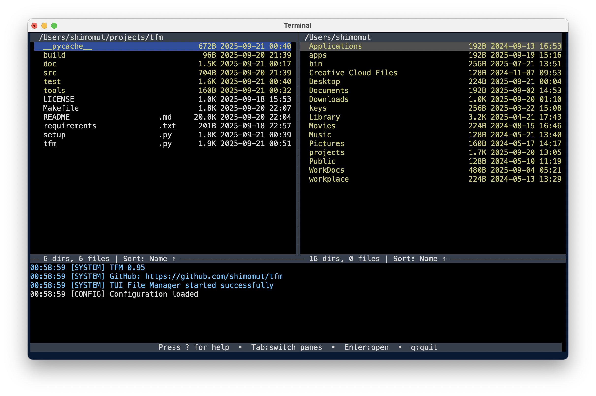
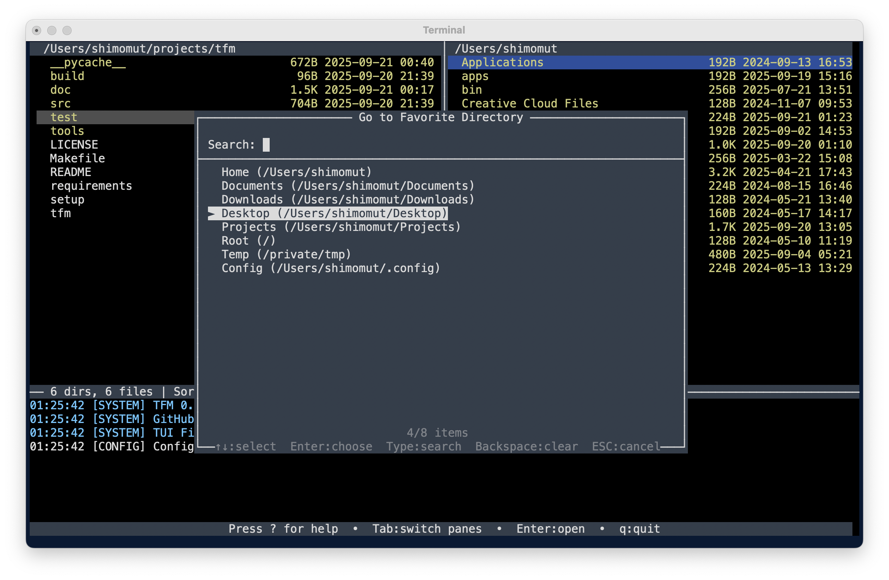

# TUI File Manager - "TFM"

A powerful terminal-based file manager built with Python's curses library. Navigate your filesystem with keyboard shortcuts in a clean, intuitive dual-pane interface with comprehensive file operations, advanced text editing, and professional-grade features.

## Key Benefits

🚀 **Efficiency**: Navigate and manage files faster than traditional GUI file managers with keyboard-driven operations  
⚡ **Speed**: Threaded search capabilities and configurable progress tracking  
🎯 **Precision**: Advanced selection, filtering, and search features for exact file management  
🔧 **Customizable**: Fully configurable key bindings, color schemes, and behavior settings  
💻 **Universal**: Works on any terminal - macOS, Linux, Windows with proper terminal support  
🎨 **Professional**: Clean dual-pane interface with syntax highlighting and intelligent file handling  
📦 **Complete**: Built-in text viewer, archive operations, and external program integration  
🔍 **Smart**: Incremental search, pattern filtering, threaded content search, and remote log monitoring  
🔗 **Integrated**: VSCode integration, Beyond Compare support, and extensible external program system  
🎛️ **Flexible**: Command line directory specification and workflow customization

## Development with Kiro

This application was developed using [Kiro](https://kiro.dev/) heavily - an AI-powered development assistant. Approximately 99% of the code was auto-generated from natural language based interactive chat sessions, demonstrating the power of AI-assisted development for creating complex, feature-rich applications.

## Features

### Core Interface
- **Dual Pane Interface**: Left and right panes for easy file operations between directories
- **Command Line Directory Control**: Specify initial directories with `--left` and `--right` arguments
- **Log Pane**: Bottom pane captures stdout and stderr output with timestamps and remote monitoring
- **Pane Switching**: Use Tab to switch between panes, active pane highlighted in header
- **Resizable Panes**: Adjust pane sizes with bracket keys and shift+bracket keys
- **Status Bar**: Shows current path, file count, and operation status
- **State Management**: Automatic saving and restoration of pane positions, cursor locations, and settings



<div align="center">




</div>

### Navigation & Display
- **Directory Navigation**: Browse directories with arrow keys
- **File Information**: View file sizes, modification dates, and permissions
- **Hidden Files**: Toggle visibility of hidden files with '.'
- **Sorting**: Multiple sort options (name, size, date, type)
- **Color Schemes**: Multiple color schemes optimized for different terminal backgrounds
  - **Dark Scheme**: Colorful interface optimized for dark terminal backgrounds (default)
  - **Light Scheme**: High-contrast monochrome (white/black) optimized for light terminal backgrounds
  - **Runtime Toggle**: Press 't' to switch between schemes instantly

### File Operations
- **Basic Operations**: Copy (C), Move (M), Delete (K), Rename (R) files and directories
- **Batch Operations**: Multi-selection with Space bar, select all files (a) or all items (A)
- **Advanced Rename**: Regex-based batch renaming with macros (\0, \1-\9, \d for indexing)
- **File Creation**: Create new text files (E) and directories (M when no selection) with auto-editing
- **Archive Support**: Create (P) and extract (U) ZIP, TAR.GZ, TGZ archives between panes
- **Progress Tracking**: Configurable animations (spinner, dots, progress bar, etc.)
- **Safety Features**: Confirmation dialogs, permission checks, conflict resolution
- **Smart Selection**: Context-aware operations based on selection state (required/none/any)

### Text Handling
- **Text File Viewer**: Built-in text viewer with syntax highlighting for 20+ file formats
- **Text Editor Integration**: Edit files directly with your preferred text editor (vim, nano, etc.)
- **Syntax Highlighting**: Support for Python, JavaScript, JSON, Markdown, YAML, and more
- **Line Numbers**: Toggle line numbers in text viewer
- **Search in Files**: Search functionality within viewed text files

### System Integration
- **Sub-shell Mode**: Suspend TFM and enter shell with environment variables (X key)
- **External Programs**: Integration with custom commands and scripts (x key)
- **VSCode Integration**: Direct integration to open directories and files in Visual Studio Code
- **Beyond Compare Integration**: File and directory comparison with Beyond Compare
- **Remote Log Monitoring**: Stream logs to remote terminals for debugging
- **Configuration System**: Fully customizable key bindings and settings (Z key)
- **Help System**: Comprehensive help dialog accessible with '?' key
- **Cross-platform**: Works on macOS, Linux, and Windows with proper terminal support


## Favorite Directories

Quick access to frequently used directories:

- **Access**: Press 'J' to open favorites dialog
- **Search**: Type to filter favorites by name or path
- **Customize**: Edit `~/.tfm/config.py` to add your own favorites
- **Default Locations**: Includes common directories (Home, Documents, Downloads, etc.)

## Help System

TFM includes a comprehensive help dialog that provides quick access to all key bindings and features:

- **Access**: Press `?` to open the help dialog
- **Content**: Organized sections covering navigation, file operations, search, sorting, and more
- **Navigation**: Scroll through help content with arrow keys, Page Up/Down, Home/End
- **Main Screen Access**: Accessible from the main file manager screen
- **Context-Sensitive**: Shows relevant shortcuts for current mode

The help dialog is your quick reference guide - no need to memorize all key bindings!

## Default Key Bindings

All key bindings are fully customizable through the configuration system. Below are the default mappings:

### Navigation
| Key | Action |
|-----|--------|
| `↑↓` | Navigate files up/down |
| `←→` | Switch panes / Navigate directories |
| `Tab` | Switch between left and right panes |
| `Enter` | Enter directory or view text file with syntax highlighting |
| `Backspace` | Go to parent directory |
| `Home / End` | Go to first / last file |
| `Page Up/Down` | Navigate by page |

### File Operations
| Key | Action |
|-----|--------|
| `Space` | Select/deselect file (for multi-selection) |
| `a` | Select all files |
| `A` | Select all items (files + directories) |
| `c/C` | Copy selected files to opposite pane |
| `m/M` | Move selected files to opposite pane |
| `k/K` | Delete selected files (with confirmation) |
| `r/R` | Rename file (single) / Batch rename (multiple selected) |
| `e` | Edit existing file with text editor |
| `E` | Create new text file and edit |
| `F7` | Create new directory |
| `p/P` | Create archive from selected files (.zip, .tar.gz, .tgz) |
| `u/U` | Extract archive to other pane |
| `v/V` | View text file in built-in viewer |
| `i/I` | Show file details |
| `w/W` | Compare selection (match files in other pane) |

### Search & Sorting
| Key | Action |
|-----|--------|
| `f` | Incremental search (isearch) with filtering |
| `F` | Threaded filename search dialog with live results |
| `G` | Threaded content search dialog (grep) with progress tracking |
| `;` | Filter files by filename pattern (fnmatch: *.py, test_*, etc.) |
| `:` | Clear filter from current pane |
| `s/S` | Sort menu with searchable options |
| `1` | Quick sort by name (toggle reverse if already active) |
| `2` | Quick sort by extension (toggle reverse if already active) |
| `3` | Quick sort by size (toggle reverse if already active) |
| `4` | Quick sort by date (toggle reverse if already active) |

### View Options
| Key | Action |
|-----|--------|
| `.` | Toggle hidden files |
| `t` | Toggle color scheme (Dark/Light) |
| `o` | Sync current pane to other pane |
| `O` | Sync other pane to current pane |
| `[` | Make left pane smaller (adjust boundary left) |
| `]` | Make left pane larger (adjust boundary right) |
| `-` | Reset pane split to 50/50 |

### Log Pane Controls
| Key | Action |
|-----|--------|
| `{` | Make log pane larger (Shift+[) |
| `}` | Make log pane smaller (Shift+]) |
| `_` | Reset log pane height to default (Shift+-) |
| `Shift+Up` | Scroll log up (toward older messages) |
| `Shift+Down` | Scroll log down (toward newer messages) |
| `Shift+Left` | Fast scroll up (toward older messages) |
| `Shift+Right` | Fast scroll down (toward newer messages) |


### Advanced Features
| Key | Action |
|-----|--------|
| `j` | Show favorite directories with search |
| `J` | Jump to directory dialog with intelligent scanning |
| `h/H` | Show directory history for current pane |
| `x` | Show external programs menu |
| `X` | Enter sub-shell mode with environment variables |
| `T` | Toggle fallback color mode |
| `z` | View options menu |
| `Z` | Settings and configuration menu |

### General
| Key | Action |
|-----|--------|
| `?` | Show help dialog |
| `q/Q` | Quit TFM |
| `Ctrl+R` | Refresh file list |
| `ESC` | Cancel current operation |

## Text Viewer

TFM includes a built-in text file viewer with syntax highlighting support. When you press `Enter` on a text file or use the `v` key, the file opens in the integrated viewer.

### Text Viewer Features
- **Syntax highlighting** for 20+ file formats (Python, JavaScript, JSON, Markdown, YAML, etc.)
- **Line numbers** (toggle with `n`)
- **Horizontal scrolling** (arrow keys)
- **Status bar** showing position, file size, format, and active options
- **Multiple encoding support** (UTF-8, Latin-1, CP1252)
- **Automatic file type detection**

### Text Viewer Controls
| Key | Action |
|-----|--------|
| `q` or `ESC` | Exit viewer |
| `↑↓` | Scroll up/down |
| `←→` | Scroll left/right |
| `Page Up/Down` | Page scrolling |
| `Home/End` | Jump to start/end |
| `n` | Toggle line numbers |
| `w` | Toggle line wrapping |
| `s` | Toggle syntax highlighting |
| `/` | Search within file |

### Supported File Formats
- **Programming Languages**: Python, JavaScript, Java, C/C++, Go, Rust, PHP, Ruby, Shell
- **Markup Languages**: HTML, XML, Markdown, reStructuredText
- **Data Formats**: JSON, YAML, CSV, TSV, TOML
- **Configuration Files**: INI, Dockerfile, Makefile, and more

### Enhanced Syntax Highlighting
For full syntax highlighting, install pygments:
```bash
pip install pygments
```
The viewer works without pygments but displays plain text only.

## Sub-shell Mode

TFM's sub-shell mode allows you to temporarily suspend the interface and enter a shell environment with pre-configured environment variables that provide access to the current state of both file panes and selected files.

### Activation
- Press `x` or `X` to enter sub-shell mode
- TFM suspends and starts a new shell session
- Shell prompt shows `[TFM]` label for identification
- Type `exit` to return to TFM

### Environment Variables
When entering sub-shell mode, these environment variables are automatically set:

#### Directory Variables
- `TFM_LEFT_DIR`: Absolute path of the left file pane directory
- `TFM_RIGHT_DIR`: Absolute path of the right file pane directory  
- `TFM_THIS_DIR`: Absolute path of the currently focused pane directory
- `TFM_OTHER_DIR`: Absolute path of the non-focused pane directory

#### Selected Files Variables
- `TFM_LEFT_SELECTED`: Space-separated list of selected file names in the left pane
- `TFM_RIGHT_SELECTED`: Space-separated list of selected file names in the right pane
- `TFM_THIS_SELECTED`: Space-separated list of selected file names in the focused pane
- `TFM_OTHER_SELECTED`: Space-separated list of selected file names in the non-focused pane

#### Additional Variables
- `TFM_ACTIVE`: Set to '1' to indicate TFM sub-shell mode is active

## Advanced Features

### Batch Rename System
Powerful regex-based renaming for multiple files:
- **Regex Support**: Full Python regex syntax with capture groups (\1-\9)
- **Macros**: Use \0 for full filename, \d for sequential numbering
- **Preview**: See rename results before executing
- **Professional Editing**: Full cursor movement in input fields with Tab navigation

### Threaded Search & Filtering
- **Incremental Search**: File filtering as you type (f key)
- **Pattern Filtering**: Use ';' with fnmatch patterns (*.py, test_*, etc.)
- **Threaded Content Search**: Non-blocking search within files with progress tracking (G key)
- **Threaded Filename Search**: Asynchronous filename search with live results (F key)
- **Search Cancellation**: Automatic cancellation and restart when patterns change
- **Result Limiting**: Configurable maximum results to prevent memory issues

### Pane Management & State
- **Directory Sync**: Sync pane directories (o/O keys) and cursor positions
- **Smart Behavior**: Auto-detects same directory for cursor synchronization
- **Resizable Layout**: Adjust pane boundaries with bracket keys ([, ], {, })
- **State Persistence**: Automatic saving and restoration of window state, cursor positions
- **History Management**: Per-pane directory history with configurable limits

### Searchable Dialogs & Components
All list interfaces support filtering:
- **Favorite Directories**: Quick navigation with search and customizable bookmarks
- **Jump Dialog**: Intelligent directory scanning with search capabilities
- **Sort Options**: Interactive sorting menu with search
- **External Programs**: Searchable program menu with custom commands
- **Conflict Resolution**: Searchable file operation dialogs

### Remote Monitoring & Integration
- **Remote Log Monitoring**: Stream TFM logs to remote terminals for debugging
- **Command Line Directory Specification**: Override saved history with `--left` and `--right` arguments
- **VSCode Integration**: Open current directory and selected files in VS Code
- **Beyond Compare Integration**: Compare files and directories with Beyond Compare
- **External Program Framework**: Extensible system for custom tool integration

## Command Line Options

TFM supports several command line arguments for customizing startup behavior:

### Directory Specification
```bash
# Specify left pane directory
python3 tfm.py --left /path/to/projects

# Specify right pane directory  
python3 tfm.py --right /path/to/documents

# Specify both panes
python3 tfm.py --left ./src --right ./test

# Use relative paths
python3 tfm.py --left . --right ..
```

### Remote Log Monitoring
```bash
# Enable remote log monitoring on specified port
python3 tfm.py --remote-log-port 8888
```

### Combined Usage
```bash
# Development workflow: source code on left, tests on right, with remote monitoring
python3 tfm.py --left ./src --right ./test --remote-log-port 8888

# File organization: downloads on left, documents on right
python3 tfm.py --left ~/Downloads --right ~/Documents
```

### Command Line Features
- **Directory Override**: Command line directories override saved history/state
- **Path Validation**: Invalid paths fall back to defaults with warning messages
- **Flexible Paths**: Supports absolute, relative, and home directory paths (`~/`)
- **History Preservation**: Other pane settings (sort mode, filters) are still restored from history
- **Backward Compatible**: Works with existing usage patterns when no arguments provided

### Help and Version
```bash
# Show help with all available options
python3 tfm.py --help

# Show version information
python3 tfm.py --version
```

## Installation & Usage

### Quick Start
1. Ensure you have Python 3.6+ installed
2. Clone or download TFM
3. Run the file manager:
   ```bash
   python3 tfm.py
   ```

### Advanced Usage
```bash
# Enable remote log monitoring on port 8888
python3 tfm.py --remote-log-port 8888

# Start with specific directories for left and right panes
python3 tfm.py --left /path/to/projects --right /path/to/documents

# Combine options for development workflow
python3 tfm.py --left ./src --right ./test --remote-log-port 8888

# Connect to remote logs from another terminal
python3 tools/tfm_log_client.py localhost 8888
```

### Package Installation
```bash
# Install from source
python3 setup.py install

# Run installed version
tfm

# With specific directories and remote monitoring
tfm --left ~/projects --right ~/documents --remote-log-port 8888
```

### Dependencies
- **Required**: Python 3.6+ with curses library (built-in on Unix systems)
- **Optional**: `pygments` for enhanced syntax highlighting
  ```bash
  pip install pygments
  ```

### System Requirements
- Python 3.6+
- Terminal with curses support (most Unix terminals, Windows Terminal, etc.)
- Write permissions for configuration directory (`~/.tfm/`)

### External Tool Integration
- **VSCode**: Install `code` command for VSCode integration
- **Beyond Compare**: Install Beyond Compare for file/directory comparison
- **Custom Tools**: Add your own external programs via configuration

## Configuration

TFM features a comprehensive configuration system that allows complete customization of behavior, key bindings, and appearance through a Python configuration file.

### Configuration File Management

**Automatic Setup**: TFM automatically creates `~/.tfm/config.py` from the built-in template on first launch  
**Easy Access**: Open configuration from the Settings menu (`Z` key) or edit manually  
**Template-Based**: Clean separation between default settings and user customizations  
**Live Validation**: Configuration errors are reported with fallback to safe defaults

### Configuration File Location

- **User Config**: `~/.tfm/config.py` - Your personal customizations
- **Template**: `src/_config.py` - Default configuration template
- **Access Methods**:
  - Press `Z` key → Settings Menu → Edit Configuration
  - Manually edit `~/.tfm/config.py`
  - TFM creates the file automatically if it doesn't exist

### New Configuration Options

#### Performance & Threading
- **MAX_SEARCH_RESULTS**: Maximum search results (default: 10,000)
- **MAX_JUMP_DIRECTORIES**: Maximum directories for jump dialog (default: 5,000)
- **MAX_HISTORY_ENTRIES**: Maximum history entries per pane (default: 100)
- **MAX_LOG_MESSAGES**: Maximum log entries to keep in memory (default: 1,000)

#### Progress Animation
- **PROGRESS_ANIMATION_PATTERN**: Animation style ('spinner', 'dots', 'progress', 'bounce', 'pulse', 'wave', 'clock', 'arrow')
- **PROGRESS_ANIMATION_SPEED**: Animation frame update interval (default: 0.2 seconds)

#### Advanced Key Bindings
- **Selection-aware bindings**: Actions can require specific selection states
- **Multiple key support**: Assign multiple keys to the same action
- **Context-sensitive operations**: Different behavior based on selection state

### Customizable Settings

#### Display & Behavior
- **Color Schemes**: Dark/Light themes with runtime switching
- **Pane Layout**: Default pane ratios and log height
- **File Display**: Hidden files, extension separation, sorting preferences
- **Confirmations**: Customize which operations require confirmation

#### Key Bindings
- **Fully Customizable**: Every keyboard shortcut can be remapped
- **Multiple Keys**: Assign multiple keys to the same action
- **Comprehensive Coverage**: All TFM features have configurable bindings

#### Directories & Programs
- **Startup Paths**: Set default directories for left and right panes
- **Favorite Directories**: Quick access bookmarks with searchable dialog
- **External Programs**: Custom commands and scripts integration
- **Text Editor**: Choose your preferred editor (vim, nano, emacs, code, etc.)

### Example Configuration

```python
class Config:
    # Display preferences
    COLOR_SCHEME = 'dark'  # 'dark' or 'light'
    SHOW_HIDDEN_FILES = False
    DEFAULT_LEFT_PANE_RATIO = 0.6  # 60% left, 40% right
    DEFAULT_LOG_HEIGHT_RATIO = 0.25  # 25% log pane
    
    # Behavior settings
    CONFIRM_DELETE = True
    CONFIRM_COPY = False  # Skip copy confirmations for speed
    CONFIRM_MOVE = False  # Skip move confirmations for speed
    
    # Performance settings
    MAX_SEARCH_RESULTS = 10000  # Maximum search results
    MAX_JUMP_DIRECTORIES = 5000  # Maximum directories for jump dialog
    MAX_HISTORY_ENTRIES = 100  # Maximum history entries per pane
    
    # Progress animation
    PROGRESS_ANIMATION_PATTERN = 'spinner'  # Animation style
    PROGRESS_ANIMATION_SPEED = 0.2  # Update interval in seconds
    
    # Startup directories
    STARTUP_LEFT_PATH = "~/projects"
    STARTUP_RIGHT_PATH = "~/Downloads"
    
    # Text editor
    TEXT_EDITOR = 'code'  # VS Code, or 'vim', 'nano', etc.
    
    # Selection-aware key bindings
    KEY_BINDINGS = {
        'quit': ['q'],  # Remove 'Q' binding
        'search': ['/', 'f'],  # Add '/' for search
        'file_details': ['i', 'I', 'd'],  # Add 'd' for details
        'copy_files': {'keys': ['c', 'C', 'y'], 'selection': 'required'},  # Requires selection
        'create_directory': {'keys': ['m', 'M'], 'selection': 'none'},  # Only when no selection
        'toggle_color_scheme': ['t', 'T'],  # Both cases
        # ... customize any action
    }
    
    # Favorite directories
    FAVORITE_DIRECTORIES = [
        {'name': 'Home', 'path': '~'},
        {'name': 'Projects', 'path': '~/dev'},
        {'name': 'Work', 'path': '/work/projects'},
        {'name': 'Config', 'path': '~/.config'},
    ]
    
    # External programs with VSCode and Beyond Compare integration
    PROGRAMS = [
        {'name': 'Open in VSCode', 'command': ['./tools/vscode_wrapper.sh'], 
         'options': {'auto_return': True}},
        {'name': 'Compare Files (Beyond Compare)', 'command': ['./tools/bcompare_files_wrapper.sh'], 
         'options': {'auto_return': True}},
        {'name': 'Compare Directories (Beyond Compare)', 'command': ['./tools/bcompare_dirs_wrapper.sh'], 
         'options': {'auto_return': True}},
        {'name': 'Git Status', 'command': ['git', 'status']},
        {'name': 'Preview Files', 'command': ['./tools/preview_files.sh']},
    ]
```

### Accessing Configuration

#### Through TFM Interface
1. **Settings Menu**: Press `Z` key to open the settings menu
2. **Edit Configuration**: Select "Edit Configuration" to open `config.py` in your text editor
3. **Automatic Creation**: If no config exists, TFM creates one from the template
4. **Live Reload**: Changes take effect when you restart TFM

#### Manual Configuration
1. **Direct Edit**: Open `~/.tfm/config.py` in any text editor
2. **Template Reference**: Check `src/_config.py` for all available options
3. **Validation**: TFM validates settings and reports errors on startup

### Configuration Categories

#### Key Binding Actions
All actions support multiple key assignments and selection-aware behavior:
- **Navigation**: `quit`, `help`, `toggle_hidden`, `toggle_color_scheme`
- **File Operations**: `copy_files`, `move_files`, `delete_files`, `rename_file`, `create_file`, `create_directory`
- **Search & Filter**: `search`, `search_dialog`, `search_content`, `filter`, `clear_filter`
- **Sorting**: `sort_menu`, `quick_sort_name`, `quick_sort_ext`, `quick_sort_size`, `quick_sort_date`
- **Selection**: `select_file`, `select_all_files`, `select_all_items`, `compare_selection`
- **Pane Management**: `sync_current_to_other`, `sync_other_to_current`, `adjust_pane_left`, `adjust_pane_right`, `adjust_log_up`, `adjust_log_down`, `reset_log_height`
- **Advanced**: `favorites`, `jump_dialog`, `history`, `subshell`, `programs`, `create_archive`, `extract_archive`
- **View Options**: `view_text`, `edit_file`, `file_details`, `view_options`, `settings_menu`, `toggle_fallback_colors`

#### Confirmation Settings
Control which operations require user confirmation:
- `CONFIRM_DELETE` - File/directory deletion (recommended: True)
- `CONFIRM_QUIT` - Application exit
- `CONFIRM_COPY` - File copying operations
- `CONFIRM_MOVE` - File moving operations  
- `CONFIRM_EXTRACT_ARCHIVE` - Archive extraction

#### Performance Settings
- `MAX_LOG_MESSAGES` - Maximum log entries to keep in memory
- `SEPARATE_EXTENSIONS` - Show file extensions in separate column
- `MAX_EXTENSION_LENGTH` - Maximum extension length for separation

## Project Structure

```
tfm/
├── src/                    # Source code
│   ├── tfm_main.py        # Main application logic and FileManager class
│   ├── tfm_config.py      # Configuration system and defaults
│   ├── tfm_const.py       # Constants and version information
│   ├── tfm_colors.py      # Color management and terminal colors
│   ├── tfm_text_viewer.py # Text file viewer with syntax highlighting
│   ├── tfm_*_dialog.py    # Modular dialog components (list, search, batch rename, etc.)
│   ├── tfm_*_manager.py   # Core managers (log, pane, file operations, progress, state)
│   ├── tfm_external_programs.py # External program integration
│   └── _config.py         # User configuration template
├── test/                   # Test files and demos
│   ├── test_*.py          # Unit and integration tests
│   ├── demo_*.py          # Interactive feature demonstrations
│   ├── verify_*.py        # Feature verification scripts
│   ├── test_command_line_*.py # Command line argument tests
│   └── test_log_*.py      # Log redraw trigger tests
├── doc/                    # Documentation
│   ├── *_FEATURE.md       # Feature documentation and guides
│   ├── *_SYSTEM.md        # System component documentation
│   ├── COMMAND_LINE_DIRECTORY_ARGUMENTS_FEATURE.md # Command line directory specification
│   ├── LOG_REDRAW_TRIGGER_FEATURE.md # Log update system
│   └── PROJECT_STRUCTURE.md # Detailed project organization
├── tools/                  # External integration tools
│   ├── vscode_wrapper.sh  # VSCode integration script
│   ├── bcompare_*.sh      # Beyond Compare integration scripts
│   ├── tfm_log_client.py  # Remote log monitoring client with color-coded output
│   └── preview_files.sh   # File preview script
├── demo/                   # Interactive demonstrations
│   └── demo_*.py          # Feature demonstration scripts
├── tfm.py                  # Main entry point with argument parsing
├── setup.py               # Package setup for pip installation
├── Makefile               # Build automation and common tasks
├── requirements.txt       # Python dependencies (pygments)
└── README.md              # This file
```

### Getting Help
- Press `?` in TFM for built-in help
- Check documentation in the `doc/` directory

## Remote Log Monitoring

TFM includes a powerful remote log monitoring feature for debugging and system monitoring:

### Usage
```bash
# Start TFM with remote log monitoring
python3 tfm.py --remote-log-port 8888

# Connect from another terminal
python3 tools/tfm_log_client.py localhost 8888
```

### TFM Log Client (`tfm_log_client.py`)

The included log client provides a dedicated terminal interface for monitoring TFM logs remotely:

#### Features
- **Color-coded Output**: Different log sources (SYSTEM, ERROR, STDOUT, STDERR) displayed in distinct colors
- **Network Connectivity**: Connect to TFM instances on local or remote machines
- **JSON Processing**: Handles structured log data with automatic parsing
- **Graceful Handling**: Manages connection errors and server disconnections
- **Keyboard Interrupt**: Clean exit with Ctrl+C

#### Usage Examples
```bash
# Connect to local TFM instance
python3 tools/tfm_log_client.py localhost 8888

# Connect to remote TFM instance
python3 tools/tfm_log_client.py 192.168.1.100 8888

# Connect with default parameters (localhost:8888)
python3 tools/tfm_log_client.py

# Disable colored output
python3 tools/tfm_log_client.py --no-color localhost 8888
```

#### Use Cases
- **Development Debugging**: Monitor file operations and errors during development
- **Remote System Administration**: Watch TFM activity on remote servers
- **Multi-terminal Workflows**: Keep logs visible while working in TFM
- **Automated Monitoring**: Script-friendly output for log processing
- **Team Collaboration**: Multiple developers can monitor the same TFM session

### Features
- **Network streaming**: Log messages sent to connected clients
- **Multiple clients**: Support for multiple monitoring terminals
- **Network capable**: Works locally and across networks
- **JSON format**: Structured data for easy parsing
- **Color-coded output**: Different log sources displayed in different colors
- **Automatic management**: Handles client connections and disconnections gracefully

## VSCode Integration

Direct integration with Visual Studio Code for seamless development workflow:

### Features
- **Smart directory opening**: Opens current directory or git repository root
- **File selection**: Opens selected files directly in VSCode
- **Git repository detection**: Automatically finds and opens repository root
- **Safe handling**: Properly handles files with spaces and special characters

### Usage
1. Navigate to desired directory in TFM
2. Optionally select files to open
3. Press `x` → "Open in VSCode"

## Beyond Compare Integration

Professional file and directory comparison with Beyond Compare:

### Features
- **File comparison**: Compare selected files between panes
- **Directory comparison**: Compare entire directories
- **Integration scripts**: Wrapper scripts handle TFM environment variables
- **Automatic detection**: Uses TFM's current pane and selection state

## Contributing
TFM welcomes contributions! The modular project structure makes it easy to add new features:

## Contact Author

Have questions, suggestions, or found a bug? Get in touch:

- **GitHub Repository**: [https://github.com/shimomut/tfm](https://github.com/shimomut/tfm)
- **GitHub Issues**: [Report bugs or request features](https://github.com/shimomut/tfm/issues)
- **Author's X (Twitter)**: [@smmrtmnr](https://x.com/smmrtmnr)

We welcome feedback and contributions to make TFM even better!

## License
TFM is released under the MIT License. See LICENSE file for details.

---

**TFM - Terminal File Manager**: Efficient, keyboard-driven file management for the terminal with advanced features, threading support, and professional integrations.