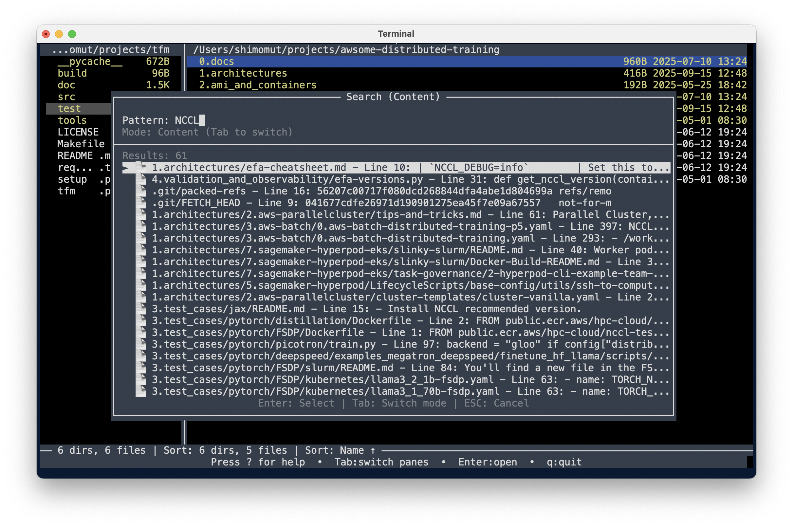

# TFM - TUI File Manager

A powerful terminal-based file manager built with Python's curses library. Navigate your filesystem with keyboard shortcuts in a clean, intuitive dual-pane interface with comprehensive file operations, advanced text editing, and professional-grade features.

## Key Features

- **Dual-pane interface** with independent navigation and cross-pane operations
- **Archive browsing** - Navigate ZIP, TAR, and compressed archives as virtual directories
- **Advanced search** with real-time filtering and background processing  
- **Multi-selection** with bulk operations and progress tracking
- **Built-in text viewer** with syntax highlighting for 20+ file formats
- **External program integration** with configurable launchers
- **AWS S3 support** for cloud storage operations
- **Customizable interface** with multiple color schemes and key bindings
- **Remote log monitoring** for debugging and system monitoring

## Development with Kiro

This application was developed using [Kiro](https://kiro.dev/) heavily - an AI-powered development assistant. Approximately 99% of the code was auto-generated from natural language based interactive chat sessions, demonstrating the power of AI-assisted development for creating complex, feature-rich applications.

## Screenshots


<div align="center">





</div>


## Quick Start

### Installation
1. Ensure you have Python 3.9+ installed
2. Clone or download TFM
3. Run the file manager:
   ```bash
   python3 tfm.py
   ```

### Essential Controls
- **Navigate:** `↑↓` to move up/down, `←→` to switch panes/navigate directories
- **Enter archives:** Press `Enter` on `.zip`, `.tar`, `.tar.gz` files to browse contents
- **Select:** `Space` to select/deselect files, `a` for all files, `A` for all items
- **File operations:** `c/C` (copy), `m/M` (move), `k/K` (delete), `r/R` (rename)
- **Help:** `?` for comprehensive help dialog
- **Quit:** `q/Q` to exit

### Help System
Press `?` to open the comprehensive help dialog with all key bindings and features organized by category. The help dialog is your quick reference guide - no need to memorize all shortcuts!

## Documentation

For comprehensive information about TFM's features and usage:

### User Documentation
- **[Complete User Guide](doc/TFM_USER_GUIDE.md)** - Comprehensive guide covering all features, configuration, and usage
- **[Archive Virtual Directory Browsing](doc/ARCHIVE_VIRTUAL_DIRECTORY_FEATURE.md)** - Browse archives as directories
- **[Remote Log Monitoring](doc/REMOTE_LOG_MONITORING_FEATURE.md)** - Real-time log monitoring setup and usage
- **[Search Animation](doc/SEARCH_ANIMATION_FEATURE.md)** - Advanced search features and visual feedback

### Developer Documentation
- **[Path Polymorphism System](doc/dev/PATH_POLYMORPHISM_SYSTEM.md)** - Storage-agnostic architecture and extensibility
- **[Navigation System](doc/dev/NAVIGATION_SYSTEM.md)** - Core navigation implementation
- **[Remote Log Implementation](doc/dev/REMOTE_LOG_MONITORING_IMPLEMENTATION.md)** - Technical details of log monitoring
- **[External Programs](doc/dev/EXTERNAL_PROGRAMS_IMPLEMENTATION.md)** - Program integration system

## Key Features Overview

All key bindings are fully customizable through the configuration system. For complete key binding reference, press `?` in TFM or see the [User Guide](doc/TFM_USER_GUIDE.md).

### Core Operations
- **Navigation:** Arrow keys, Tab to switch panes, Enter to open directories/files/archives
- **Archive Browsing:** Press Enter on `.zip`, `.tar`, `.tar.gz`, `.tgz`, `.tar.bz2`, `.tar.xz` files to browse as virtual directories
- **File Operations:** Copy (`c/C`), Move (`m/M`), Delete (`k/K`), Rename (`r/R`)
- **Selection:** Space to select files, `a` for all files, `A` for all items
- **Search:** `f` for incremental search, `F` for filename search, `G` for content search
- **Archives:** `p/P` to create archives, `u/U` to extract, Enter to browse contents
- **Text Viewer:** `v/V` to view files with syntax highlighting (works inside archives)

### Advanced Features
- **Favorite Directories:** `j` for quick access to bookmarked locations
- **External Programs:** `x` for custom program integration
- **Sub-shell Mode:** `X` to enter shell with TFM environment variables
- **Configuration:** `Z` for settings menu
- **AWS S3 Support:** Navigate S3 buckets using `s3://bucket/path` syntax

## Archive Virtual Directory Browsing

TFM lets you browse archive files as if they were regular directories - no extraction needed!

**Supported formats:** `.zip`, `.tar`, `.tar.gz`, `.tgz`, `.tar.bz2`, `.tar.xz`

**How to use:**
1. Navigate to any archive file
2. Press `Enter` to browse its contents
3. Navigate directories inside the archive with arrow keys
4. Press `Enter` on files to view them
5. Copy files out with `F5` (or your copy key)
6. Search within archives with `Alt+F7`
7. Press `Backspace` to exit the archive

**What you can do:**
- Browse nested directories within archives
- View text files with syntax highlighting
- Copy files and directories from archives to local/S3
- Search for files by name or content
- Select multiple files for batch operations
- Sort by name, size, date, or extension

See [Archive Virtual Directory Feature](doc/ARCHIVE_VIRTUAL_DIRECTORY_FEATURE.md) for complete documentation.

## Built-in Text Viewer

TFM includes a powerful text viewer with syntax highlighting for 20+ file formats. Press `Enter` on text files or use `v` to open the viewer. Works seamlessly with files inside archives!

**Features:**
- Syntax highlighting for Python, JavaScript, JSON, Markdown, YAML, and more
- Line numbers, horizontal scrolling, search functionality
- Multiple encoding support (UTF-8, Latin-1, CP1252)
- View files directly from archives without extraction

**Enhanced highlighting:** Install `pygments` for full syntax support:
```bash
pip install pygments
```

## Sub-shell Mode

Press `X` to temporarily suspend TFM and enter a shell with environment variables providing access to current directories and selected files:

- `TFM_LEFT_DIR`, `TFM_RIGHT_DIR` - Directory paths for each pane
- `TFM_THIS_DIR`, `TFM_OTHER_DIR` - Current and other pane directories  
- `TFM_LEFT_SELECTED`, `TFM_RIGHT_SELECTED` - Selected files in each pane
- `TFM_ACTIVE` - Set to '1' to indicate TFM sub-shell mode

Type `exit` to return to TFM.

## Advanced Features

- **Archive Virtual Directories:** Browse ZIP, TAR, and compressed archives as if they were directories - navigate, search, view files, and copy contents without extraction
- **Batch Rename:** Regex-based renaming with capture groups and macros
- **Threaded Search:** Non-blocking filename and content search with progress tracking (works inside archives)
- **Pane Management:** Resizable layout, directory sync, state persistence
- **External Integration:** VSCode, Beyond Compare, and custom program support
- **Remote Log Monitoring:** Stream logs to remote terminals for debugging
- **AWS S3 Support:** Navigate and manage S3 buckets with seamless local/remote operations

For detailed information on all features, see the [User Guide](doc/TFM_USER_GUIDE.md).

## Command Line Options

```bash
# Specify startup directories
python3 tfm.py --left /path/to/projects --right /path/to/documents

# Enable remote log monitoring
python3 tfm.py --remote-log-port 8888

# Combined usage
python3 tfm.py --left ./src --right ./test --remote-log-port 8888

# Help and version
python3 tfm.py --help
python3 tfm.py --version
```

## Installation

### Requirements
- Python 3.9+ with curses library (built-in on Unix systems)
- Terminal with curses support

### Optional Dependencies
```bash
pip install pygments  # Enhanced syntax highlighting
pip install boto3     # AWS S3 support
```

### Installation Options
```bash
# Run directly
python3 tfm.py

# Install from source
python3 setup.py install
tfm
```

## Configuration

TFM is highly configurable through `~/.tfm/config.py`. Access configuration via the Settings menu (`Z` key) or edit manually.

**Key areas:**
- Color schemes and display preferences
- Key bindings (fully customizable)
- External programs and text editor
- Favorite directories and startup paths
- Performance and behavior settings

For detailed configuration options, see the [User Guide](doc/TFM_USER_GUIDE.md#configuration).

## Project Structure

```
tfm/
├── src/           # Core application code
├── test/          # Test files (720+ passing tests)
├── doc/           # User documentation
├── doc/dev/       # Developer documentation
├── tools/         # External integration scripts
├── demo/          # Interactive demonstrations
└── tfm.py         # Main entry point
```

## Remote Log Monitoring

Monitor TFM operations remotely for debugging:

```bash
# Start TFM with remote log monitoring
python3 tfm.py --remote-log-port 8888

# Connect from another terminal
python3 tools/tfm_log_client.py localhost 8888
```

The log client provides color-coded output for different log sources and handles network connectivity gracefully.

## Troubleshooting

**Installation Issues:**
- Ensure Python 3.9+ is installed
- Check terminal compatibility with curses library

**Performance Issues:**
- Install `pygments` for better text viewer performance
- Check available memory for large directory operations
- First access to large archives may be slow while structure is cached

**Archive Issues:**
- Verify archive file is not corrupted
- Ensure you have read permissions for the archive
- Check supported formats: `.zip`, `.tar`, `.tar.gz`, `.tgz`, `.tar.bz2`, `.tar.xz`
- Archives are read-only - use copy operations to extract files

For detailed troubleshooting, see the [User Guide](doc/TFM_USER_GUIDE.md#troubleshooting).

## Contact Author

Have questions, suggestions, or found a bug? Get in touch:

- **GitHub Repository**: [https://github.com/shimomut/tfm](https://github.com/shimomut/tfm)
- **GitHub Issues**: [Report bugs or request features](https://github.com/shimomut/tfm/issues)
- **Author's X (Twitter)**: [@smmrtmnr](https://x.com/smmrtmnr)

We welcome feedback and contributions to make TFM even better!

## License

MIT License - see [LICENSE](LICENSE) file for details.

## Support

- **Issues:** Create an issue on the project repository
- **Documentation:** Review files in `doc/` and `doc/dev/` directories
- **User Guide:** See [TFM_USER_GUIDE.md](doc/TFM_USER_GUIDE.md) for comprehensive information