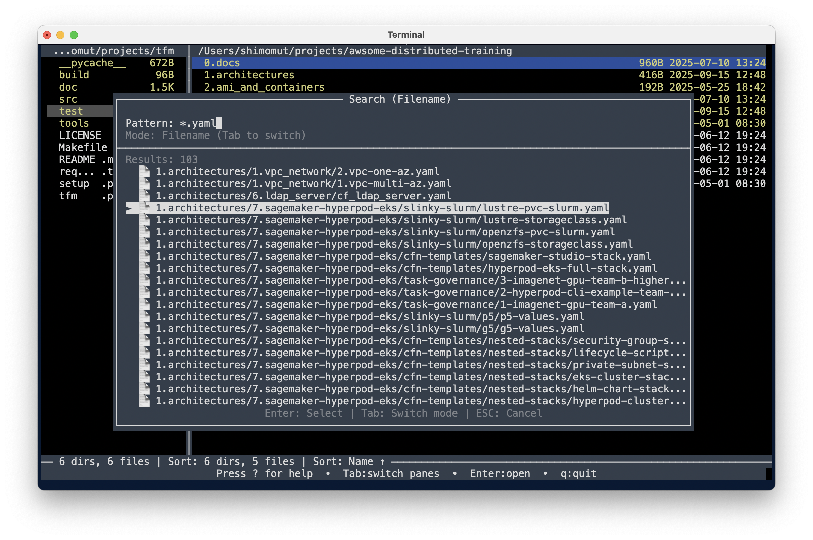

# TUI File Manager - "TFM"

A powerful terminal-based file manager built with Python's curses library. Navigate your filesystem with keyboard shortcuts in a clean, intuitive dual-pane interface with comprehensive file operations, advanced text editing, and professional-grade features.

## Key Benefits

🚀 **Efficiency**: Navigate and manage files faster than traditional GUI file managers with keyboard-driven operations  
⚡ **Speed**: Instant file operations with real-time progress tracking and batch processing capabilities  
🎯 **Precision**: Advanced selection, filtering, and search features for exact file management  
🔧 **Customizable**: Fully configurable key bindings, color schemes, and behavior settings  
💻 **Universal**: Works on any terminal - macOS, Linux, Windows with proper terminal support  
🎨 **Professional**: Clean dual-pane interface with syntax highlighting and intelligent file handling  
📦 **Complete**: Built-in text viewer, archive operations, and external program integration  
🔍 **Smart**: Incremental search, pattern filtering, and content search capabilities

## Development with Kiro

This application was developed using [Kiro](https://kiro.dev/) heavily - an AI-powered development assistant. Approximately 99% of the code was auto-generated from natural language based interactive chat sessions, demonstrating the power of AI-assisted development for creating complex, feature-rich applications.

## Features

### Core Interface
- **Dual Pane Interface**: Left and right panes for easy file operations between directories
- **Log Pane**: Bottom pane captures stdout and stderr output with timestamps
- **Pane Switching**: Use Tab to switch between panes, active pane highlighted in header
- **Resizable Panes**: Adjust pane sizes with Ctrl+Left/Right and Ctrl+U/D
- **Status Bar**: Shows current path, file count, and operation status


<div align="center">





</div>

### Navigation & Display
- **Directory Navigation**: Browse directories with arrow keys or vim-style navigation (j/k)
- **File Information**: View file sizes, modification dates, and permissions
- **Hidden Files**: Toggle visibility of hidden files with '.'
- **Sorting**: Multiple sort options (name, size, date, type)
- **Color Schemes**: Multiple color schemes optimized for different terminal backgrounds
  - **Dark Scheme**: Colorful interface optimized for dark terminal backgrounds (default)
  - **Light Scheme**: High-contrast monochrome (white/black) optimized for light terminal backgrounds
  - **Runtime Toggle**: Press 't' to switch between schemes instantly
- **Color Coding**: 
  - Blue/bold for directories
  - Green for executable files
  - Yellow highlight for selected items in active pane
  - Underline for selected items in inactive pane
  - Red text for stderr messages in log pane

### File Operations
- **Copy Files**: Copy files/directories between panes with 'C' key
- **Move Files**: Move files/directories between panes with 'M' key
- **Delete Files**: Delete files/directories with 'K' key (with confirmation)
- **Rename Files**: Single file rename with 'R' key, batch rename for multiple selections
- **Batch Rename**: Advanced regex-based renaming with macros (\0, \1-\9, \d for indexing)
- **Create Files**: Create new text files with 'E' key and auto-edit
- **Create Directories**: Create new directories with 'M' key (when no selection)
- **Create Archives**: Create ZIP, TAR.GZ, or TGZ archives with 'P' key
- **Extract Archives**: Extract ZIP, TAR.GZ, TGZ archives with 'U' key to other pane
- **Fine-Grained Progress**: Real-time progress display for individual files in multi-file operations (copy, move, delete, archive)
- **Multi-Selection**: Select multiple files with Space bar for batch operations
- **Advanced Selection**: Select all files ('a'), all items ('A'), or toggle selection upward (Ctrl+Space)
- **Conflict Resolution**: Interactive dialogs for handling existing files

### Text Handling
- **Text File Viewer**: Built-in text viewer with syntax highlighting for 20+ file formats
- **Text Editor Integration**: Edit files directly with your preferred text editor (vim, nano, etc.)
- **Syntax Highlighting**: Support for Python, JavaScript, JSON, Markdown, YAML, and more
- **Line Numbers**: Toggle line numbers in text viewer
- **Search in Files**: Search functionality within viewed text files

### Advanced Features
- **Sub-shell Mode**: Suspend TFM and enter shell with environment variables for current state
- **Favorite Directories**: Quick access to frequently used directories with 'J' key
- **Advanced Search**: Filename search ('f') and content search with multiple patterns
- **File Filtering**: Filter files by pattern (';') with fnmatch support (*.py, test_*, etc.)
- **Intelligent Sorting**: Quick sort by name (1), size (2), date (3) with reverse toggle
- **Pane Synchronization**: Sync directories ('o'/'O') and cursor positions between panes
- **Professional Text Editing**: Full cursor movement, insertion, deletion in all input fields
- **Searchable Lists**: Filter and search through files and directories
- **Configuration System**: Fully customizable key bindings and settings
- **Help System**: Comprehensive help dialog accessible with '?' key
- **Log Management**: Scroll through log messages with Ctrl+K/L, auto-scrolls to newest
- **Cross-platform**: Works on macOS, Linux, and Windows (with proper terminal support)

## File Operations

TFM provides comprehensive file management capabilities with intuitive keyboard shortcuts:

### Basic Operations
- **Copy**: Select files with Space, press 'C' to copy to opposite pane
- **Move**: Select files with Space, press 'M' to move to opposite pane  
- **Delete**: Select files with Space, press 'K' to delete (with confirmation)
- **Rename**: Navigate to file, press 'R' to rename in-place

### Advanced Operations
- **Multi-Selection**: Use Space to select multiple files for batch operations
- **Conflict Resolution**: Interactive dialogs handle existing files during copy/move
- **Directory Operations**: All operations work on directories (recursive)
- **Symbolic Links**: Proper handling of symbolic links (preserved during operations)
- **Archive Creation**: Create compressed archives from selected files/directories

### File Creation & Archives
- **New Files**: Press 'E' to create and immediately edit new text files
- **New Directories**: Press 'M' with no selection to create new directories
- **Create Archives**: Press 'P' to create ZIP, TAR.GZ, or TGZ archives from selected files
- **Extract Archives**: Press 'U' to extract archives to the opposite pane
- **Smart Extraction**: Creates directory named after archive (without extension)
- **Auto-Editor**: New files automatically open in your configured text editor

### Safety Features
- **Confirmation Dialogs**: All destructive operations require confirmation
- **Permission Checks**: Operations validate permissions before execution
- **Error Handling**: Clear error messages for failed operations
- **Undo Protection**: Parent directory (..) cannot be accidentally modified

## Favorite Directories

Quick access to frequently used directories:

- **Access**: Press 'J' to open favorites dialog
- **Search**: Type to filter favorites by name or path
- **Customize**: Edit `~/.tfm/config.py` to add your own favorites
- **Default Locations**: Includes common directories (Home, Documents, Downloads, etc.)

## Help System

TFM includes a comprehensive help dialog that provides quick access to all key bindings and features:

- **Access**: Press `?` to open the help dialog
- **Content**: Organized sections covering navigation, file operations, search, sorting, and more
- **Navigation**: Scroll through help content with arrow keys, Page Up/Down, Home/End
- **Always Available**: Accessible from any screen in TFM
- **Context-Sensitive**: Shows relevant shortcuts for current mode

The help dialog is your quick reference guide - no need to memorize all key bindings!

## Default Key Bindings

All key bindings are fully customizable through the configuration system. Below are the default mappings:

### Navigation
| Key | Action |
|-----|--------|
| `↑↓ / j k` | Navigate files up/down |
| `←→ / h l` | Switch panes / Navigate directories |
| `Tab` | Switch between left and right panes |
| `Enter` | Enter directory or view text file with syntax highlighting |
| `Backspace` | Go to parent directory |
| `Home / End` | Go to first / last file |
| `Page Up/Down` | Navigate by page |

### File Operations
| Key | Action |
|-----|--------|
| `Space` | Select/deselect file (for multi-selection) |
| `Ctrl+Space` | Select file and move up |
| `a` | Select all files |
| `A` | Select all items (files + directories) |
| `c/C` | Copy selected files to opposite pane |
| `m/M` | Move selected files to opposite pane |
| `k/K` | Delete selected files (with confirmation) |
| `r/R` | Rename file (single) / Batch rename (multiple selected) |
| `e` | Edit existing file with text editor |
| `E` | Create new text file and edit |
| `F7` | Create new directory |
| `p/P` | Create archive from selected files (.zip, .tar.gz, .tgz) |
| `u/U` | Extract archive to other pane |
| `v/V` | View text file in built-in viewer |
| `i/I` | Show file details |
| `w/W` | Compare selection (match files in other pane) |

### Search & Sorting
| Key | Action |
|-----|--------|
| `f` | Incremental search (isearch) |
| `F` | Filename search dialog |
| `G` | Content search dialog (grep) |
| `;` | Filter files by filename pattern (fnmatch: *.py, test_*, etc.) |
| `:` | Clear filter from current pane |
| `s/S` | Sort menu |
| `1` | Quick sort by name (toggle reverse if already active) |
| `2` | Quick sort by extension (toggle reverse if already active) |
| `3` | Quick sort by size (toggle reverse if already active) |
| `4` | Quick sort by date (toggle reverse if already active) |

### View Options
| Key | Action |
|-----|--------|
| `.` | Toggle hidden files |
| `t` | Toggle color scheme (Dark/Light) |
| `o` | Sync current pane to other pane |
| `O` | Sync other pane to current pane |
| `[` | Make left pane smaller (adjust boundary left) |
| `]` | Make left pane larger (adjust boundary right) |
| `-` | Reset pane split to 50/50 |

### Log Pane Controls
| Key | Action |
|-----|--------|
| `{` | Make log pane larger (Shift+[) |
| `}` | Make log pane smaller (Shift+]) |
| `_` | Reset log pane height to default (Shift+-) |
| `Shift+Up` | Scroll log up (toward older messages) |
| `Shift+Down` | Scroll log down (toward newer messages) |
| `Shift+Left` | Fast scroll up (toward older messages) |
| `Shift+Right` | Fast scroll down (toward newer messages) |

### Advanced Features
| Key | Action |
|-----|--------|
| `j/J` | Show favorite directories |
| `x` | Show external programs menu |
| `X` | Enter sub-shell mode |
| `T` | File type filter dialog |
| `z` | Toggle fallback color mode |
| `Z` | View options menu |
| `L` | Settings and configuration menu |

### General
| Key | Action |
|-----|--------|
| `?` | Show help dialog |
| `q/Q` | Quit TFM |
| `Ctrl+R` | Refresh file list |
| `ESC` | Cancel current operation |

## Text Viewer

TFM includes a built-in text file viewer with syntax highlighting support. When you press `Enter` on a text file or use the `v` key, the file opens in the integrated viewer.

### Text Viewer Features
- **Syntax highlighting** for 20+ file formats (Python, JavaScript, JSON, Markdown, YAML, etc.)
- **Line numbers** (toggle with `n`)
- **Horizontal scrolling** (arrow keys)
- **Status bar** showing position, file size, format, and active options
- **Multiple encoding support** (UTF-8, Latin-1, CP1252)
- **Automatic file type detection**

### Text Viewer Controls
| Key | Action |
|-----|--------|
| `q` or `ESC` | Exit viewer |
| `↑↓` or `j/k` | Scroll up/down |
| `←→` or `h/l` | Scroll left/right |
| `Page Up/Down` | Page scrolling |
| `Home/End` | Jump to start/end |
| `n` | Toggle line numbers |
| `w` | Toggle line wrapping |
| `s` | Toggle syntax highlighting |
| `/` | Search within file |

### Supported File Formats
- **Programming Languages**: Python, JavaScript, Java, C/C++, Go, Rust, PHP, Ruby, Shell
- **Markup Languages**: HTML, XML, Markdown, reStructuredText
- **Data Formats**: JSON, YAML, CSV, TSV, TOML
- **Configuration Files**: INI, Dockerfile, Makefile, and more

### Enhanced Syntax Highlighting
For full syntax highlighting, install pygments:
```bash
pip install pygments
```
The viewer works without pygments but displays plain text only.

## Sub-shell Mode

TFM's sub-shell mode allows you to temporarily suspend the interface and enter a shell environment with pre-configured environment variables that provide access to the current state of both file panes and selected files.

### Activation
- Press `x` or `X` to enter sub-shell mode
- TFM suspends and starts a new shell session
- Shell prompt shows `[TFM]` label for identification
- Type `exit` to return to TFM

### Environment Variables
When entering sub-shell mode, these environment variables are automatically set:

#### Directory Variables
- `LEFT_DIR`: Absolute path of the left file pane directory
- `RIGHT_DIR`: Absolute path of the right file pane directory  
- `THIS_DIR`: Absolute path of the currently focused pane directory
- `OTHER_DIR`: Absolute path of the non-focused pane directory

#### Selected Files Variables
- `LEFT_SELECTED`: Space-separated list of selected file names in the left pane
- `RIGHT_SELECTED`: Space-separated list of selected file names in the right pane
- `THIS_SELECTED`: Space-separated list of selected file names in the focused pane
- `OTHER_SELECTED`: Space-separated list of selected file names in the non-focused pane

### Usage Examples

```bash
# List files in both panes
ls -la "$LEFT_DIR" "$RIGHT_DIR"

# Copy selected files from current pane to other pane
for file in $THIS_SELECTED; do
    cp "$THIS_DIR/$file" "$OTHER_DIR/"
done

# Compare directory sizes
du -sh "$LEFT_DIR" "$RIGHT_DIR"

# Find files in both directories
find "$LEFT_DIR" "$RIGHT_DIR" -name "*.py"

# Archive selected files
if [ -n "$THIS_SELECTED" ]; then
    cd "$THIS_DIR"
    tar -czf selected_files.tar.gz $THIS_SELECTED
fi
```

### Test Scripts
- `python3 test_subshell.py` - Test environment variables
- `python3 demo_subshell.py` - See usage examples

## Advanced Features Detail

### Batch Rename System
TFM includes a powerful batch rename feature for multiple selected files:

#### Activation
- Select multiple files with Space bar
- Press 'R' to enter batch rename mode
- Use Tab to switch between regex pattern and destination pattern fields

#### Regex Patterns & Macros
- **Full Regex Support**: Use Python regex syntax for pattern matching
- **Capture Groups**: `\1` to `\9` for regex capture groups
- **Full Filename**: `\0` for entire original filename
- **Sequential Numbering**: `\d` for index numbers (1, 2, 3, ...)

#### Examples
```
Files: file1.txt, file2.txt, file3.txt
Regex: (.*)
Destination: backup_\1
Result: backup_file1.txt, backup_file2.txt, backup_file3.txt

Files: doc1.txt, doc2.txt
Regex: (.*)\.txt
Destination: \1.md
Result: doc1.md, doc2.md

Files: photo.jpg, image.jpg
Regex: (.*)\.(.*) 
Destination: \1_\d.\2
Result: photo_1.jpg, image_2.jpg
```

#### Professional Text Editing
- **Full Cursor Movement**: Left/Right arrows, Home/End keys
- **Visual Cursor**: Reversed color highlighting shows exact cursor position
- **Insert/Delete**: Edit at any position, not just at the end
- **Real-time Preview**: See rename results before executing

### Archive Operations
- **Create Archives**: Select files, press 'P', choose ZIP, TAR.GZ, or TGZ format
- **Extract Archives**: Press 'U' on any archive to extract to opposite pane
- **Smart Directory Creation**: Extraction creates directory named after archive
- **Conflict Handling**: Prompts for confirmation if target directory exists

### File Filtering & Search
- **Pattern Filtering**: Use ';' to filter files by pattern (directories always shown)
- **Fnmatch Support**: `*.py`, `test_*`, `*.[ch]`, etc.
- **Multi-pattern Search**: Search supports multiple space-separated patterns
- **Clear Filters**: Use ':' (Shift+;) to clear current pane filter

### Pane Synchronization
- **Directory Sync**: 'o' syncs current pane to other, 'O' syncs other to current
- **Cursor Sync**: When both panes show same directory, syncs cursor positions
- **Smart Behavior**: Automatically detects same directory and switches to cursor sync

### Searchable Dialogs
TFM features powerful searchable list dialogs for various operations:

#### Features
- **Real-time Filtering**: Type to filter items as you search
- **Keyboard Navigation**: Full keyboard control with arrow keys
- **Fast Scrolling**: Page Up/Down for large lists
- **Visual Selection**: Clear indication of selected item
- **Cancel Support**: ESC to cancel any dialog

#### Used For
- **Favorite Directories**: Quick navigation to bookmarked locations
- **File Operations**: Conflict resolution during copy/move operations
- **Sort Options**: Interactive sorting menu

## Installation & Usage

### Quick Start
1. Ensure you have Python 3.6+ installed
2. Clone or download TFM
3. Run the file manager:
   ```bash
   python3 tfm.py
   ```

### Package Installation
```bash
# Install from source
python3 setup.py install

# Run installed version
tfm
```

### Using Make
```bash
# Run TFM
make run

# Run tests
make test

# Install package
make install
```

### Dependencies
- **Required**: Python 3.6+ with curses library (built-in on Unix systems)
- **Optional**: `pygments` for enhanced syntax highlighting
  ```bash
  pip install pygments
  ```

### System Requirements
- Python 3.6+
- Terminal with curses support (most Unix terminals, Windows Terminal, etc.)
- Write permissions for configuration directory (`~/.tfm/`)

## Configuration

TFM features a comprehensive configuration system that allows complete customization of behavior, key bindings, and appearance through a Python configuration file.

### Configuration File Management

**Automatic Setup**: TFM automatically creates `~/.tfm/config.py` from the built-in template on first launch  
**Easy Access**: Open configuration from the Settings menu (`L` key) or edit manually  
**Template-Based**: Clean separation between default settings and user customizations  
**Live Validation**: Configuration errors are reported with fallback to safe defaults

### Configuration File Location

- **User Config**: `~/.tfm/config.py` - Your personal customizations
- **Template**: `src/_config.py` - Default configuration template
- **Access Methods**:
  - Press `L` key → Settings Menu → Edit Configuration
  - Manually edit `~/.tfm/config.py`
  - TFM creates the file automatically if it doesn't exist

### Customizable Settings

#### Display & Behavior
- **Color Schemes**: Dark/Light themes with runtime switching
- **Pane Layout**: Default pane ratios and log height
- **File Display**: Hidden files, extension separation, sorting preferences
- **Confirmations**: Customize which operations require confirmation

#### Key Bindings
- **Fully Customizable**: Every keyboard shortcut can be remapped
- **Multiple Keys**: Assign multiple keys to the same action
- **Comprehensive Coverage**: All TFM features have configurable bindings

#### Directories & Programs
- **Startup Paths**: Set default directories for left and right panes
- **Favorite Directories**: Quick access bookmarks with searchable dialog
- **External Programs**: Custom commands and scripts integration
- **Text Editor**: Choose your preferred editor (vim, nano, emacs, code, etc.)

### Example Configuration

```python
class Config:
    # Display preferences
    COLOR_SCHEME = 'dark'  # 'dark' or 'light'
    SHOW_HIDDEN_FILES = False
    DEFAULT_LEFT_PANE_RATIO = 0.6  # 60% left, 40% right
    DEFAULT_LOG_HEIGHT_RATIO = 0.2  # 20% log pane
    
    # Behavior settings
    CONFIRM_DELETE = True
    CONFIRM_COPY = False  # Skip copy confirmations for speed
    CONFIRM_MOVE = False  # Skip move confirmations for speed
    
    # Startup directories
    STARTUP_LEFT_PATH = "~/projects"
    STARTUP_RIGHT_PATH = "~/Downloads"
    
    # Text editor
    TEXT_EDITOR = 'code'  # VS Code, or 'vim', 'nano', etc.
    
    # Custom key bindings
    KEY_BINDINGS = {
        'quit': ['q'],  # Remove 'Q' binding
        'search': ['/', 'f'],  # Add vim-like '/' for search
        'file_details': ['i', 'I', 'd'],  # Add 'd' for details
        'copy_files': ['c', 'C', 'y'],  # Add 'y' for yank/copy
        'toggle_color_scheme': ['t', 'T'],  # Both cases
        # ... customize any action
    }
    
    # Favorite directories
    FAVORITE_DIRECTORIES = [
        {'name': 'Home', 'path': '~'},
        {'name': 'Projects', 'path': '~/dev'},
        {'name': 'Work', 'path': '/work/projects'},
        {'name': 'Config', 'path': '~/.config'},
    ]
    
    # External programs
    PROGRAMS = [
        {'name': 'Git Status', 'command': ['git', 'status']},
        {'name': 'My Script', 'command': ['/path/to/script.sh']},
        {'name': 'Quick Command', 'command': ['ls', '-la'], 
         'options': {'auto_return': True}},
    ]
```

### Accessing Configuration

#### Through TFM Interface
1. **Settings Menu**: Press `L` key to open the settings menu
2. **Edit Configuration**: Select "Edit Configuration" to open `config.py` in your text editor
3. **Automatic Creation**: If no config exists, TFM creates one from the template
4. **Live Reload**: Changes take effect when you restart TFM

#### Manual Configuration
1. **Direct Edit**: Open `~/.tfm/config.py` in any text editor
2. **Template Reference**: Check `src/_config.py` for all available options
3. **Validation**: TFM validates settings and reports errors on startup

### Configuration Categories

#### Key Binding Actions
All actions support multiple key assignments:
- **Navigation**: `quit`, `help`, `toggle_hidden`, `toggle_color_scheme`
- **File Operations**: `copy_files`, `move_files`, `delete_files`, `rename_file`, `create_file`
- **Search & Filter**: `search`, `search_dialog`, `search_content`, `filter`, `clear_filter`
- **Sorting**: `sort_menu`, `quick_sort_name`, `quick_sort_ext`, `quick_sort_size`, `quick_sort_date`
- **Selection**: `select_file`, `select_all_files`, `select_all_items`, `compare_selection`
- **Pane Management**: `sync_current_to_other`, `sync_other_to_current`, `adjust_pane_left`, `adjust_pane_right`
- **Advanced**: `favorites`, `subshell`, `programs`, `create_archive`, `extract_archive`

#### Confirmation Settings
Control which operations require user confirmation:
- `CONFIRM_DELETE` - File/directory deletion (recommended: True)
- `CONFIRM_QUIT` - Application exit
- `CONFIRM_COPY` - File copying operations
- `CONFIRM_MOVE` - File moving operations  
- `CONFIRM_EXTRACT_ARCHIVE` - Archive extraction

#### Performance Settings
- `MAX_LOG_MESSAGES` - Maximum log entries to keep in memory
- `SEPARATE_EXTENSIONS` - Show file extensions in separate column
- `MAX_EXTENSION_LENGTH` - Maximum extension length for separation

## Project Structure

```
tfm/
├── src/                    # Source code
│   ├── tfm_main.py        # Main application logic and FileManager class
│   ├── tfm_config.py      # Configuration system and defaults
│   ├── tfm_const.py       # Constants and version information
│   ├── tfm_colors.py      # Color management and terminal colors
│   ├── tfm_text_viewer.py # Text file viewer with syntax highlighting
│   └── _config.py         # User configuration template
├── test/                   # Test files and demos
│   ├── test_*.py          # Unit and integration tests
│   ├── demo_*.py          # Interactive feature demonstrations
│   └── verify_*.py        # Feature verification scripts
├── doc/                    # Documentation
│   ├── *.md               # Feature documentation and guides
│   └── PROJECT_STRUCTURE.md # Detailed project organization
├── tfm.py                  # Main entry point
├── setup.py               # Package setup for pip installation
├── Makefile               # Build automation and common tasks
├── requirements.txt       # Python dependencies
└── README.md              # This file
```

## Architecture

### Core Components
- **FileManager Class**: Main application controller in `tfm_main.py`
- **Configuration System**: User-customizable settings in `tfm_config.py`
- **Color Management**: Terminal color support in `tfm_colors.py`
- **Text Viewer**: Built-in file viewer in `tfm_text_viewer.py`
- **Dialog System**: User interaction dialogs for operations

### Key Features
- **Modular Design**: Clean separation between components
- **Event-Driven**: Keyboard input drives all operations
- **State Management**: Proper state handling for all modes and dialogs
- **Error Handling**: Comprehensive error reporting and recovery
- **Extensible**: Easy to add new features and operations

## Development & Testing

TFM includes comprehensive testing and development tools:

### Running Tests
```bash
# Run all tests
make test

# Run specific feature tests
python3 test/test_copy_integration.py
python3 test/test_move_integration.py
python3 test/test_delete_integration.py

# Interactive demos
python3 test/demo_favorites.py
python3 test/demo_create_file.py
```

### Development Setup
```bash
# Development installation
make dev-install

# Run from source
python3 tfm.py

# Clean temporary files
make clean
```

## Tips & Best Practices

### Efficient Workflows
- **Multi-Selection**: Use Space to select multiple files, then perform batch operations
- **Quick Navigation**: Use 'o'/'O' to sync panes for easy comparison
- **Pattern Filtering**: Use ';' with patterns like `*.py` or `test_*` to focus on specific files
- **Quick Sorting**: Use number keys 1, 2, 3 for instant sorting by name, size, date
- **Batch Rename**: Select multiple files and use regex patterns for powerful renaming

### Advanced Usage
- **Color Scheme Switching**: Press 't' to instantly switch between Dark and Light themes
- **Archive Workflows**: Create archives with 'P', extract with 'U' to opposite pane
- **Text Editing**: All input fields support full cursor movement and professional editing
- **Sub-shell Integration**: Use 'x' to access shell with TFM environment variables
- **Log Monitoring**: Use Ctrl+K/L to scroll through operation logs and messages

### Keyboard Efficiency
- **Selection Shortcuts**: 'a' for all files, 'A' for all items, Ctrl+Space for upward selection
- **Pane Management**: Tab to switch, '-' to reset split, Opt+arrows to adjust
- **Quick Access**: 'J' for favorites, '?' for help, '.' to toggle hidden files, 't' to toggle colors

## Troubleshooting

### Common Issues

**Terminal Display Problems**
- Ensure your terminal supports curses
- Try resizing the terminal window
- Check terminal color support

**Key Binding Conflicts**
- Customize key bindings in `~/.tfm/config.py`
- Check for terminal-specific key mappings
- Use the help dialog (?) to verify current bindings

**Permission Errors**
- Ensure write permissions for target directories
- Check file ownership and permissions
- Run with appropriate user privileges

**Configuration Issues**
- Delete `~/.tfm/config.py` to reset to defaults
- Check configuration syntax in your custom config
- Refer to `src/_config.py` for template

### Getting Help
- Press `?` in TFM for built-in help
- Check documentation in the `doc/` directory
- Review test files for usage examples

## Contributing

TFM welcomes contributions! The project structure makes it easy to add new features:

### Adding Features
1. Implement in `src/` directory
2. Add tests in `test/` directory  
3. Document in `doc/` directory
4. Update README.md if needed

### Code Style
- Follow existing patterns and conventions
- Add comprehensive error handling
- Include tests for new functionality
- Document new features thoroughly

## License

TFM is released under the MIT License. See LICENSE file for details.


---

**TFM - Terminal File Manager**: Efficient, keyboard-driven file management for the terminal.