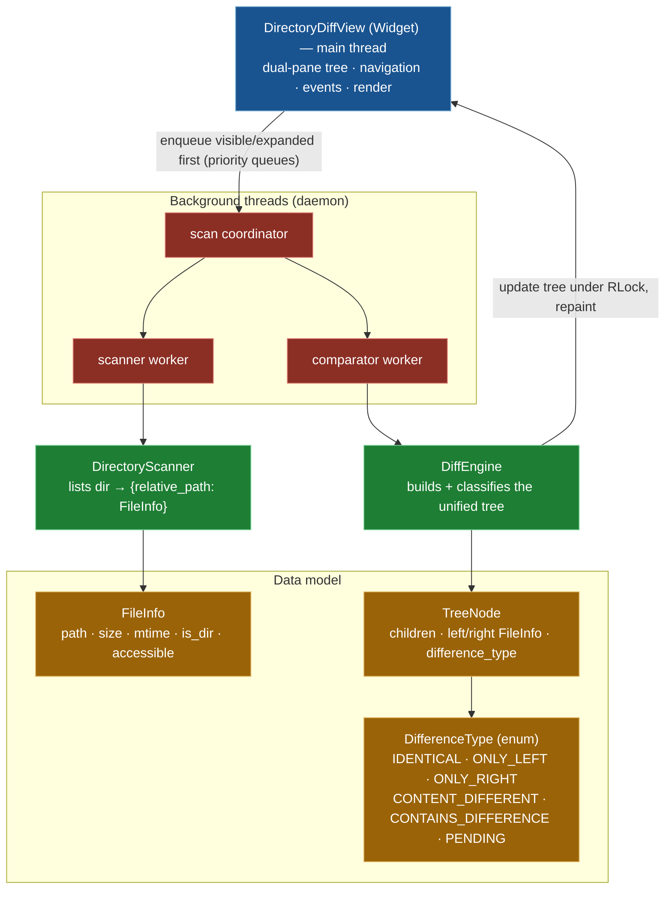

# Directory Diff Viewer System

## Overview

The Directory Diff Viewer is a sophisticated component that provides recursive directory comparison with a tree-structured display. It enables users to compare two directory trees side-by-side, identifying differences in files, directories, and their contents.

## Architecture



### Core Components

**DifferenceType Enum**
- Defines the types of differences that can be detected:
  - `IDENTICAL`: Files/directories are the same
  - `ONLY_LEFT`: Item exists only in the left directory
  - `ONLY_RIGHT`: Item exists only in the right directory
  - `CONTENT_DIFFERENT`: Two-sided files whose content differs
  - `CONTAINS_DIFFERENCE`: A directory that contains differences below it
  - `PENDING`: Not yet scanned / compared (progressive)

**Priority scheduling**
- Scan and comparison work run on two priority queues holding `(-priority, seq, node)`, so **visible and expanded** directories are processed before deep background items. Priority is an integer, not an enum.

**FileInfo Class**
- Stores metadata about files and directories:
  - Path information
  - Size and modification time
  - File type (file/directory)
  - Comparison status

### Main Classes

**DirectoryDiffView** (`Widget`)
- Primary UI component (a PuiKit `Widget`) for the dual-pane comparison tree
- Manages expand/collapse, navigation, and rendering on the main thread
- Owns the scan-coordinator plus scanner/comparator worker threads and re-prioritises the viewport

**DirectoryScanner**
- Recursively lists one directory into `{relative_path: FileInfo}`
- Iterative (stack-based); records inaccessible entries instead of aborting
- Cancellable via `cancel()`

**DiffEngine**
- Builds the unified tree from the two scan dictionaries and classifies each node
- With `compare_content=False`, two-sided files stay `PENDING` so the tree structure appears before any file is read

**TreeNode**
- A node in the comparison tree: children, left/right `FileInfo`, and `difference_type`
- Tracks expansion and progressive-scan state

## Key Features

### Progressive Scanning

The viewer implements progressive scanning to provide immediate feedback:

1. **Initial Display**: Shows directory structure immediately
2. **Priority Scanning**: Scans visible items first
3. **Background Completion**: Continues scanning in background
4. **On-Demand Expansion**: Scans subdirectories when expanded

### Threaded Comparison

File comparison runs in background threads:

- **Non-blocking**: UI remains responsive during comparison
- **Prioritized**: Visible files compared first
- **Cancellable**: Can stop comparison when closing viewer
- **Error-tolerant**: Handles permission errors and missing files

### Tree Navigation

Users can navigate the comparison tree:

- **Expand/Collapse**: Show/hide subdirectories
- **Jump to Differences**: Navigate to next/previous difference
- **Filter View**: Show only differences or all items
- **Synchronized Scrolling**: Both panes scroll together

## Implementation Details

### Scanning Algorithm

```python
# Pseudo-code for progressive scanning
def scan_directory(path, priority):
    # Scan immediate children first
    entries = list_directory(path)
    
    # Yield results immediately for display
    for entry in entries:
        yield entry
        
    # Queue subdirectories for later scanning
    for subdir in subdirectories:
        queue_scan(subdir, lower_priority)
```

### Comparison Strategy

The viewer uses different comparison strategies based on file type:

1. **Directories**: Compare by existence and structure
2. **Small Files**: Full byte-by-byte comparison
3. **Large Files**: Size and timestamp heuristics first, then content
4. **Symlinks**: Compare target paths

### Performance Optimizations

- **Lazy Loading**: Only scan directories when needed
- **Caching**: Cache comparison results to avoid re-scanning
- **Batch Processing**: Process multiple files per iteration
- **Priority Queue**: Process visible items first

## Integration Points

### File Manager Integration

The Directory Diff Viewer integrates with the main file manager:

- **Launch**: Triggered from menu or key binding
- **Path Selection**: Uses current pane paths as defaults
- **Result Actions**: Can copy/delete based on differences
- **State Persistence**: Remembers last compared directories

### Progress System

Integrates with TFM's progress system:

- **Scan Progress**: Reports scanning progress
- **Comparison Progress**: Reports comparison progress
- **Cancellation**: Supports user cancellation
- **Error Reporting**: Reports errors through progress system

## Configuration

The viewer respects several configuration options:

- **Hidden Files**: Show/hide hidden files in comparison
- **Follow Symlinks**: Whether to follow symbolic links
- **Ignore Patterns**: Patterns to exclude from comparison
- **Comparison Depth**: Maximum depth for recursive comparison

## Error Handling

The viewer handles various error conditions:

- **Permission Errors**: Mark as error, continue with other files
- **Missing Files**: Handle files deleted during comparison
- **I/O Errors**: Report and continue with remaining files
- **Thread Errors**: Gracefully handle worker thread failures

## Testing Considerations

Key areas for testing:

- **Large Directories**: Performance with thousands of files
- **Deep Hierarchies**: Deeply nested directory structures
- **Mixed Content**: Combination of files and directories
- **Error Conditions**: Permission errors, missing files
- **Cancellation**: Proper cleanup when cancelled
- **Memory Usage**: No memory leaks during long comparisons

## Related Documentation

- [Directory Diff Viewer Feature](../DIRECTORY_DIFF_VIEWER_FEATURE.md) - User documentation
- [Threaded Search Implementation](THREADED_SEARCH_IMPLEMENTATION.md) - Similar threading pattern
- [Progress Manager System](PROGRESS_MANAGER_SYSTEM.md) - Progress reporting
- [Dialog System](DIALOG_SYSTEM.md) - Dialog framework

## Future Enhancements

Potential improvements:

- **Smart Comparison**: Use checksums for faster comparison
- **Merge Operations**: Support three-way merge
- **Diff Algorithms**: Use diff algorithms for text files
- **Parallel Comparison**: Compare multiple files simultaneously
- **Incremental Updates**: Update comparison as files change
