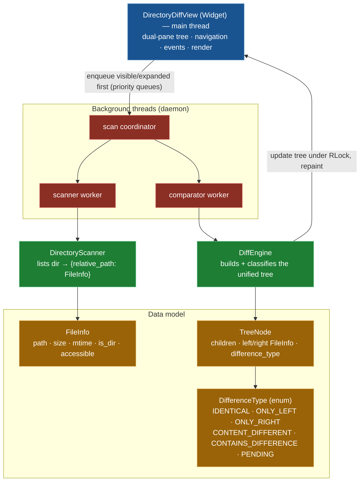

# Directory Diff Viewer System

## Overview

The Directory Diff Viewer is a sophisticated component that provides recursive directory comparison with a tree-structured display. It enables users to compare two directory trees side-by-side, identifying differences in files, directories, and their contents.

## Architecture



### Core Components

**DifferenceType Enum**
- Defines the types of differences that can be detected:
  - `IDENTICAL`: Files/directories are the same
  - `ONLY_LEFT`: Item exists only in the left directory
  - `ONLY_RIGHT`: Item exists only in the right directory
  - `CONTENT_DIFFERENT`: Two-sided files whose content differs
  - `CONTAINS_DIFFERENCE`: A directory that contains differences below it
  - `PENDING`: Not yet scanned / compared (progressive)

**Priority scheduling**
- Scan and comparison work run on two priority queues holding `(-priority, seq, node)`, so **visible and expanded** directories are processed before deep background items. Priority is an integer, not an enum.

**FileInfo Class**
- Stores metadata about files and directories:
  - Path information
  - Size and modification time
  - File type (file/directory)
  - Comparison status

### Main Classes

**DirectoryDiffView** (`Widget`)
- Primary UI component (a PuiKit `Widget`) for the dual-pane comparison tree
- Manages expand/collapse, navigation, and rendering on the main thread
- Owns the scan-coordinator plus scanner/comparator worker threads and re-prioritises the viewport

**DirectoryScanner**
- Recursively lists one directory into `{relative_path: FileInfo}`
- Iterative (stack-based); records inaccessible entries instead of aborting
- Cancellable via `cancel()`

**DiffEngine**
- Builds the unified tree from the two scan dictionaries and classifies each node
- With `compare_content=False`, two-sided files stay `PENDING` so the tree structure appears before any file is read

**TreeNode**
- A node in the comparison tree: children, left/right `FileInfo`, and `difference_type`
- Tracks expansion and progressive-scan state

## Key Features

### Progressive Scanning

The viewer implements progressive scanning to provide immediate feedback:

1. **Initial Display**: Shows directory structure immediately
2. **Priority Scanning**: Scans visible items first
3. **Background Completion**: Continues scanning in background
4. **On-Demand Expansion**: Scans subdirectories when expanded

### Threaded Comparison

File comparison runs in background threads:

- **Non-blocking**: UI remains responsive during comparison
- **Prioritized**: Visible files compared first
- **Cancellable**: Can stop comparison when closing viewer
- **Error-tolerant**: Handles permission errors and missing files

### Tree Navigation

Users can navigate the comparison tree:

- **Expand/Collapse**: Show/hide subdirectories
- **Jump to Differences**: Navigate to next/previous difference
- **Filter View**: Show only differences or all items
- **Synchronized Scrolling**: Both panes scroll together

## Implementation Details

### Scanning Algorithm

```python
# Pseudo-code for progressive scanning
def scan_directory(path, priority):
    # Scan immediate children first
    entries = list_directory(path)
    
    # Yield results immediately for display
    for entry in entries:
        yield entry
        
    # Queue subdirectories for later scanning
    for subdir in subdirectories:
        queue_scan(subdir, lower_priority)
```

### Comparison Strategy

The viewer uses different comparison strategies based on file type:

1. **Directories**: Compare by existence and structure
2. **Small Files**: Full byte-by-byte comparison
3. **Large Files**: Size and timestamp heuristics first, then content
4. **Symlinks**: Compare target paths

### Performance Optimizations

- **Lazy Loading**: Only scan directories when needed
- **Priority Queue**: Process visible items first
- **On-Demand Scanning**: User expansion scans that level immediately

## Thread Safety and the Thread → UI Bridge

Scanning and comparison run off the main thread, but **all rendering stays on the
main thread** — PuiKit has no cross-thread draw. Two mechanisms keep that safe.

### One reentrant lock

A single `threading.RLock` (`self._lock`) guards every tree mutation and the
reflow that rebuilds the flattened `visible` list. The PuiKit port deliberately
collapsed the pre-port viewer's multi-lock hierarchy (separate queue / data /
tree locks, acquired in a fixed order to avoid deadlock) into this one reentrant
lock: with a single lock there is no lock-ordering rule to get wrong. The
`*_locked` methods (`_reflow_locked`, `_insert_children_locked`,
`_reclassify_ancestors_locked`, …) are the ones that must run while holding it.

The discipline that *does* still matter is **never hold the lock across I/O**: a
worker lists a directory level (`DirectoryScanner.scan_level`) or byte-compares a
file (`DiffEngine.compare_file_content`) with no lock held, then takes `_lock`
only to merge the result — a short critical section. `visible` is reassigned
wholesale under the lock, so `draw` / `_draw_rows` read it lock-free (an atomic
snapshot). The `_dirty`, `_scanning`, and `_cancel` booleans are plain attributes
(assignment is atomic in CPython) and need no lock.

### `_dirty` + animation ticks

Workers mutate the tree and set `self._dirty = True`; a per-frame animation tick
drains it on the main thread. On push the viewer registers
`panel.request_animation_ticks(self._tick)`. `_tick()` runs each frame on the
main thread:

- if `self._cancel`, return `False` (unregisters the tick — no busy spin after
  close);
- if `self._dirty`, clear it and call `self._panel.render()`;
- return `self._scanning or self._dirty` — keep ticking while a scan is live or a
  repaint is pending, then stop once idle.

This keeps every `DrawContext` / `render` call on the main thread while preserving
the progressive-scan UX. It is the one genuinely new-in-port decision: the
pre-port viewer drove redraws directly from the worker threads through the layer
stack's dirty loop, which does not exist under PuiKit.

### Threads and queues

- **Coordinator** (`_scan_coordinator`, the one joinable thread): scans both
  roots' top level, starts the two workers, waits for both queues to drain, then
  finalises.
- **Scanner worker** (`_scanner_worker`): pulls directories off `_scan_q`, lists
  one level each (`_scan_node`), enqueues child directories (breadth-first) and
  two-sided files for comparison.
- **Comparator worker** (`_comparator_worker`): resolves two-sided files' content
  verdicts off `_cmp_q` (`_compare_node`), decoupled so neither queue blocks the
  other.

Both queues are `queue.PriorityQueue` holding `(-priority, seq, node)` — the
`seq` (an `itertools.count`) keeps items unique so two `TreeNode`s are never
compared, and negating the priority turns the min-heap into highest-first.
Priorities: `_PRIO_IMMEDIATE` (1000, user just expanded), `_PRIO_VISIBLE` (100,
on-screen), `_PRIO_NORMAL` (10, discovered off-screen). Re-prioritisation runs on
the **main thread** in `_update_priorities` (on scroll / expand / collapse) —
there is no separate priority-handler thread. `children_scanned` guards a
directory from being scanned twice; `_hi_pri` bounds a node to one viewport
re-enqueue.

Cancellation: `cancel()` sets `_cancel` and cancels the live scanners; workers
poll `_scan_q.get(timeout=0.1)` and check `_cancel`, so they wind down promptly.
Tests construct with `background=False`, running a full recursive walk plus
one-shot classification synchronously (`_scan_sync`) — no threads, deterministic.

## Active Side and Cross-Side File Operations

The viewer tracks an **active side** (`self.active`, `"left"` or `"right"`),
switched with **Tab** (the arrow keys expand/collapse the tree instead). The
active side is shown by the accent-colored, bold pane header;
`_active_side_path(node)` returns the focused node's path on that side.

The file operations the pre-port design listed as "future" have shipped, driven
through the same config `KEY_BINDINGS` and the shared `FileOperationService` the
main file manager uses:

- **Copy** (`copy_files`, default `C`) / **Move** (`move_files`, default `M`) —
  `_copy_focused` / `_move_focused` transfer the focused node from the active
  side to its *mirrored* location on the opposite side. `_mirror_dest_dir` maps
  `sub/a.txt` on the active side to `sub/` under the opposite root, keeping the
  two trees aligned.
- **Delete** (`delete_files`, default `K` / `Del`) — `_delete_focused` removes
  the focused node from the active side.
- **Merge** (`edit_file`, default `E`) — `_edit_merge` launches the configured
  `TEXT_DIFF` tool (e.g. `vimdiff`, `code --diff`) on a two-sided local file via
  the backend's suspend/resume.
- **Diff** (`view_file`, `Enter`) — `_open_file_diff` opens the per-file diff for
  a two-sided differing file (reusing `tfm_diff_viewer.show_diff_viewer`).

Each op completes via `_on_op_complete`, which rescans (`_restart_scan`) so
verdicts re-evaluate (a merged file's `!` flips to `=` live) while
`_save_expansion` / `_restore_cursor` preserve the expanded set and focus across
the rebuild.

## Integration Points

### File Manager Integration

The Directory Diff Viewer integrates with the main file manager:

- **Launch**: Triggered from menu or key binding
- **Path Selection**: Uses current pane paths as defaults
- **Result Actions**: Can copy/delete based on differences
- **State Persistence**: Remembers last compared directories

### Progress System

Integrates with TFM's progress system:

- **Scan Progress**: Reports scanning progress
- **Comparison Progress**: Reports comparison progress
- **Cancellation**: Supports user cancellation
- **Error Reporting**: Reports errors through progress system

## Configuration

The viewer respects several configuration options:

- **Hidden Files**: Show/hide hidden files in comparison
- **Follow Symlinks**: Whether to follow symbolic links
- **Ignore Patterns**: Patterns to exclude from comparison
- **Comparison Depth**: Maximum depth for recursive comparison

## Error Handling

The viewer handles various error conditions:

- **Permission Errors**: Mark as error, continue with other files
- **Missing Files**: Handle files deleted during comparison
- **I/O Errors**: Report and continue with remaining files
- **Thread Errors**: Gracefully handle worker thread failures

## Testing Considerations

Key areas for testing:

- **Large Directories**: Performance with thousands of files
- **Deep Hierarchies**: Deeply nested directory structures
- **Mixed Content**: Combination of files and directories
- **Error Conditions**: Permission errors, missing files
- **Cancellation**: Proper cleanup when cancelled
- **Memory Usage**: No memory leaks during long comparisons

## Related Documentation

- [Directory Diff Viewer Feature](../DIRECTORY_DIFF_VIEWER_FEATURE.md) - User documentation
- [Search Results Pane](SEARCH_RESULTS_PANE_IMPLEMENTATION.md) - Similar threaded background-worker pattern (`ProgressiveSearchDialog`)
- [Progress Manager System](PROGRESS_MANAGER_SYSTEM.md) - Progress reporting
- [Dialog System](DIALOG_SYSTEM.md) - Dialog framework

## Future Enhancements

Potential improvements:

- **Smart Comparison**: Use checksums for faster comparison
- **Merge Operations**: Support three-way merge
- **Diff Algorithms**: Use diff algorithms for text files
- **Parallel Comparison**: Compare multiple files simultaneously
- **Incremental Updates**: Update comparison as files change
