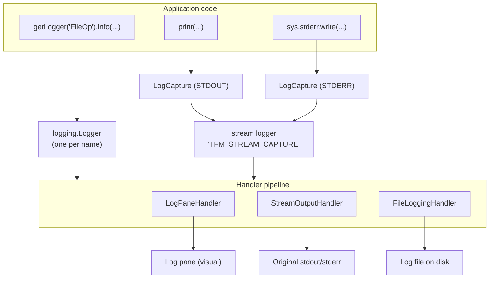

# Logging System

Developer reference for TFM's unified logging infrastructure. For the user-facing
description of the log pane and its behavior, see [`doc/LOGGING_FEATURE.md`](../LOGGING_FEATURE.md).

## Overview

TFM logging is built on Python's standard `logging` module. Component code obtains a
named `logging.Logger` and calls the usual level methods; `print()` and
`sys.stderr.write()` are also captured and routed through the same pipeline. A set of
custom handlers fan each record out to the visual log pane, the original terminal
streams, and (optionally) a log file.

The two source modules are:

- `src/tfm_log_manager.py` — `LogManager`, `LogCapture`, `LoggingConfig`, and the
  module-level `getLogger()` / `set_log_manager()` helpers.
- `src/tfm_logging_handlers.py` — the `LogPaneHandler`, `StreamOutputHandler`, and
  `FileLoggingHandler` classes plus the `should_format_record()` helper.

## Architecture



### Key components

1. **`LogManager`** — central coordination point. Owns configuration, creates and caches
   loggers, installs/removes handlers, redirects stdout/stderr, and tracks log-update
   state for redraw triggering.
2. **`LogCapture`** — a file-like object installed as `sys.stdout` / `sys.stderr`. It
   buffers text by line and emits each complete line as a `LogRecord` marked with
   `is_stream_capture = True`.
3. **`LogPaneHandler`** — stores records for the visual log pane.
4. **`StreamOutputHandler`** — writes records to the original terminal streams.
5. **`FileLoggingHandler`** — writes records to a log file.

### The `is_stream_capture` distinction

Every handler decides how to render a record via `should_format_record(record)`, which
returns `not getattr(record, 'is_stream_capture', False)`:

- **Logger-API records** (`logger.info(...)`, etc.) are formatted as
  `HH:MM:SS [LoggerName] LEVEL: message`.
- **Stream-capture records** (from `print()` / subprocess output routed through
  `LogCapture`) are emitted **raw**, with no timestamp or prefix, so external program
  output looks exactly as it would in a normal terminal.

## Using the logger

The preferred pattern (per the project coding standards) is the module-level helper. It
works before `LogManager` exists — early loggers are held as "pending" and wired to the
handlers once `set_log_manager()` runs.

```python
from tfm_log_manager import getLogger

# Module-level:
logger = getLogger("ModuleName")

# Class-based:
class MyComponent:
    def __init__(self):
        self.logger = getLogger("ComponentName")
    def foo(self):
        self.logger.info("...")
```

You can also obtain a logger from a `LogManager` instance directly with
`log_manager.getLogger("Name")`; both routes return the same cached `logging.Logger` for
a given name.

### Logger names

Names are PascalCase, descriptive, and short (<= 15 chars). Common ones include:

- **`Main`** — main application
- **`FileOp`** — file operations
- **`DirDiff`** — directory diff viewer
- **`Archive`** — archive operations
- **`Search`** — search operations

### Log levels

Standard Python levels apply:

```python
logger.debug("Detailed diagnostic info")   # DEBUG (10)
logger.info("Normal operation / user action")  # INFO (20)
logger.warning("Degraded behavior")         # WARNING (30)
logger.error("Failure / exception")         # ERROR (40)
logger.critical("Unrecoverable error")      # CRITICAL (50)
```

### Message formatting

```python
logger.info("File copied successfully")
# -> "14:23:45 [FileOp] INFO: File copied successfully"

print("Processing file...")
# -> "Processing file..."   (raw, no prefix — routed via LogCapture as STDOUT)
```

The logger-name field is left-padded to at least 6 characters for column alignment.

## Handlers

All three handlers subclass `logging.Handler`, guard their `emit()` with try/except,
and fall back to `sys.__stderr__` on failure so a broken handler never crashes the app
or blocks the others. Each uses an `RLock` for thread safety.

### `LogPaneHandler(max_messages: int = 1000)`

Stores records for the visual log pane in a bounded `deque` of `(formatted, record)`
tuples (oldest discarded past `max_messages`).

Key methods and behavior:

- `emit(record)` — formats logger records; stores stream-capture records raw. When the
  pane is not visible (see `set_visible`) it stores the record *unformatted*
  (`(None, record)`) and defers formatting for performance.
- `format_logger_message(record) -> str` — builds `HH:MM:SS [LoggerName] LEVEL: message`.
- `get_messages() -> List[Tuple[str, logging.LogRecord]]` — returns all messages,
  formatting any that were deferred while the pane was hidden.
- `set_visible(visible: bool)` — toggles the deferred-formatting optimization.
- `get_color_for_record(record) -> Tuple[int, int]` — returns a `(color_pair,
  attributes)` pair for rendering (see [Color coding](#color-coding)).

Note: the constructor takes a `max_messages` count, **not** a log-pane widget, and the
handler exposes `get_messages()` rather than pushing into a UI object. The pane reads
from the handler.

### `StreamOutputHandler(stream)`

Writes records to an original terminal stream (the constructor takes the actual stream
object, e.g. `sys.__stdout__`). Logger records are written with full formatting;
stream-capture records are written raw (a trailing newline is added if missing).
`OSError` / `IOError` on write are suppressed.

### `FileLoggingHandler(filename: str)`

Opens `filename` in append mode (UTF-8) and writes records the same way
`StreamOutputHandler` does — formatted for logger records, raw for stream capture. If the
file cannot be opened, the error is reported to the fallback stream and `emit()` becomes
a no-op. `close()` releases the file handle and is called on teardown.

## Stream capture

`LogManager` replaces `sys.stdout` / `sys.stderr` with `LogCapture` instances at
construction. `LogCapture.write()` accumulates text and, on each newline, emits a
`LogRecord` through a dedicated logger named `TFM_STREAM_CAPTURE`:

- `STDOUT` -> level `INFO`
- `STDERR` -> level `WARNING`

Records are marked `is_stream_capture = True` so handlers render them raw. Level checks
(`logger.isEnabledFor`) short-circuit record creation when the level is disabled.
`restore_stdio()` (also invoked from `__del__`) puts the original streams back.

## Configuration

`LogManager` is constructed with the TFM app config plus mode flags:

```python
LogManager(config, is_desktop_mode=False, log_file=None, no_log_pane=False)
```

- `config` — app config object; `config.MAX_LOG_MESSAGES` seeds the pane capacity.
- `is_desktop_mode` — enables writing to the original streams (terminal mode leaves the
  pane as the sole destination).
- `log_file` — when set, enables `FileLoggingHandler` at that path.
- `no_log_pane` — disables `LogPaneHandler`.

Internally these populate a `LoggingConfig` dataclass (defined in `tfm_log_manager.py`):

```python
from tfm_log_manager import LoggingConfig
import logging

LoggingConfig(
    log_pane_enabled=True,
    max_log_messages=1000,
    stream_output_enabled=None,        # None = auto-detect from mode
    stream_output_desktop_default=True,
    stream_output_terminal_default=False,
    file_logging_enabled=False,
    file_logging_path=None,
    default_log_level=logging.INFO,
    logger_levels={},                  # per-logger overrides
)
```

### Runtime reconfiguration

Handlers can be toggled at runtime without a restart:

```python
log_manager.configure_handlers(
    log_pane_enabled=True,
    stream_output_enabled=True,
)
```

`configure_handlers()` accepts only `log_pane_enabled` and `stream_output_enabled`
(each `None` = keep current); it creates or tears down the corresponding handler and
attaches/detaches it across the stream logger and every cached logger.

### Log levels

```python
log_manager.set_default_log_level(logging.DEBUG)   # global default
log_manager.set_logger_level("FileOp", logging.DEBUG)  # per-logger override
log_manager.get_logger_level("FileOp")             # effective level
log_manager.clear_logger_level("FileOp")           # revert to default
```

Per-logger overrides can be set before a logger exists; they are applied when it is
created.

## Color coding

`LogPaneHandler.get_color_for_record()` chooses colors as follows:

- **STDOUT / STDERR** (stream capture) — colored by the record name via `get_log_color()`.
- **ERROR / CRITICAL** — `COLOR_ERROR` (red).
- **WARNING** — `COLOR_LOG_WARNING` (orange).
- **DEBUG / INFO** — the STDOUT color (gray).

## Redraw integration

The main application loop polls `log_manager.has_log_updates()` each iteration and sets
`needs_full_redraw` when it returns `True`. `has_log_updates()` reports an update when the
pane handler's message count differs from `last_message_count` or the `has_new_messages`
flag is set; after the pane is drawn, `mark_log_updates_processed()` clears the flag and
snapshots the current count. This is an O(1), event-driven check — no polling timers — so
`print()` output and logger messages appear immediately without redrawing when nothing
changed.

## Thread safety and error isolation

- Each handler and `LogCapture` uses an `RLock`; logging is safe from worker threads.
- Handler `emit()` failures are caught and reported to `sys.__stderr__`; one failing
  handler never stops the others or crashes the app.
- Stream write errors in `StreamOutputHandler` are suppressed.

## Cheat sheet

### Get a logger and log

```python
from tfm_log_manager import getLogger
logger = getLogger("FileOp")

logger.debug("Debug message")
logger.info("Info message")
logger.warning("Warning message")
logger.error("Error message")
logger.critical("Critical message")
```

### Level guide

| Level | When to use | Example |
|-------|-------------|---------|
| DEBUG | Detailed diagnostics (rarely used) | `logger.debug(f"Cache hit: {key}")` |
| INFO | Normal operation, user actions | `logger.info("Operation completed")` |
| WARNING | Degraded behavior the user should know | `logger.warning("Large file detected")` |
| ERROR | Failures, exceptions, data loss | `logger.error("Permission denied")` |
| CRITICAL | Unrecoverable errors | `logger.critical("Disk full")` |

### Exception logging

```python
try:
    risky_operation()
except FileNotFoundError as e:
    logger.error(f"File not found: {e}")
except Exception as e:
    logger.error(f"Copy failed: {e}")
    # or, to include a traceback:
    logger.exception("Copy failed")
```

### Expensive debug values

```python
if logger.isEnabledFor(logging.DEBUG):
    logger.debug(f"Debug info: {compute_debug_info()}")
```

## Best practices

- Use descriptive, short PascalCase logger names; avoid generic names like `"log"`.
- Pick the right level; write specific, actionable messages
  (`logger.info(f"Copied {source} to {dest}")`, not `logger.info("Done")`).
- Don't log inside tight loops — log a summary before/after instead.
- Don't gate logging calls on `if self.logger:` — the logger is always present.
- `print()` still works and appears in the pane, but production code under `src/` must
  use the logger (see project coding standards).

## Testing

`LogManager` exposes backward-compatibility accessors that make assertions easy:

```python
def test_logging():
    log_manager = LogManager(config)
    logger = log_manager.getLogger("Test")
    logger.info("Test message")
    messages = log_manager.get_log_messages()  # list of formatted strings
    assert any("Test message" in m for m in messages)
```

For unit tests that only care that logging happened, inject a `unittest.mock.Mock` in
place of the logger and assert on `mock_logger.info.assert_called_once()`.

## Troubleshooting

- **Messages not appearing** — confirm the level (`set_default_log_level(logging.DEBUG)`)
  and that the pane handler is enabled (`configure_handlers(log_pane_enabled=True)`).
- **Too many messages / performance** — raise the level to `WARNING`, reduce
  `max_log_messages`, and avoid per-iteration logging in loops.

## Backward-compatible APIs

`LogManager.add_message(source, message)` predates the logger API and remains for
existing callers; it routes a formatted record through the same handler pipeline
(`ERROR`/`STDERR` sources map to `WARNING`, everything else to `INFO`). New code should
use `getLogger()`.

## Related documentation

- [`doc/LOGGING_FEATURE.md`](../LOGGING_FEATURE.md) — user-facing log pane feature.
- [`LOG_CLIPBOARD_IMPLEMENTATION.md`](LOG_CLIPBOARD_IMPLEMENTATION.md) — copying log
  contents to the clipboard.
