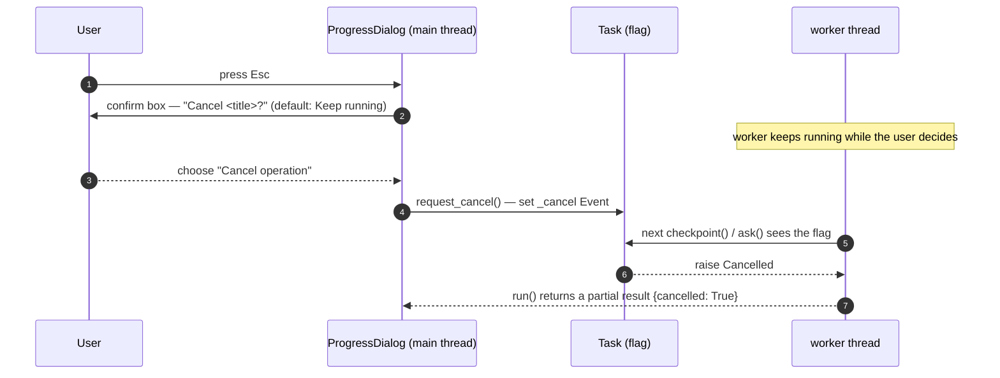

# Task Cancellation Implementation

## Overview

Long-running operations run as tasks on a background worker thread (see [Task Framework](TASK_FRAMEWORK_IMPLEMENTATION.md)). Cancellation is **cooperative**: the main thread sets a flag, and the worker unwinds itself at the next safe point, leaving a clean partial result. Nothing is force-killed.

While a task's modal `ProgressDialog` is on screen, the rest of the UI is inert — so there is no separate "block every key" logic to maintain; the modal does it structurally.

## The cooperative model

Each `Task` owns a `threading.Event` cancel flag (`_cancel`). Two calls on the worker thread observe it and raise `Cancelled` when it is set:

- `task.checkpoint()` — a non-UI check the worker calls between units of work (per file, per chunk).
- `task.ask(...)` — while blocked waiting for a modal answer, it wakes every `_WAIT_TICK` (50 ms) and raises `Cancelled` if the flag flipped, so a pending prompt cancels promptly instead of stranding the worker.

`task.cancelled()` is the non-raising form for spots that want to branch rather than unwind.

## Requesting cancellation

`Esc` on the progress dialog does **not** cancel immediately — it opens a confirm box (`Cancel operation` / `Keep running`, defaulting to keep). The worker continues while the user decides; cancellation only takes effect if confirmed, at which point `task.request_cancel()` sets the flag.

A third path reaches the same place: choosing **Cancel** in a per-file conflict dialog raises `Cancelled` directly inside the operation's `_resolve` step.

## Unwinding into a partial result

`Cancelled` propagates up through the operation body, which catches it and returns a summary dict with `cancelled = True` (the counts reflect whatever completed before the cancel). `TaskManager` then maps the outcome to `TaskStatus.CANCELLED` when finalising the task, closes the dialog, and calls the caller's `on_done` with the partial result — so a cancelled copy still reports what it managed to copy.

## Blocking other actions

The `ProgressDialog` is pushed as a modal layer; its `handle_event` returns `True` for everything, so no key or mouse event reaches the panes or menus while a task runs. Blocking is therefore a property of the modal layer, not a special case in the key handler. For callers that need to know programmatically whether work is in flight, `TaskManager.has_active()` / `active_tasks()` report the `PENDING` / `RUNNING` tasks in the registry.

## Implementation files

- `src/tfm_task.py` — `Task._cancel`, `checkpoint()`, `ask()`, `request_cancel()`; `ProgressDialog._confirm_cancel`; `TaskManager._finish`
- `src/tfm_file_operations.py` — the operation body that catches `Cancelled` and returns a partial summary (`_run`, `_resolve`)

## Related documentation

- [Task Framework](TASK_FRAMEWORK_IMPLEMENTATION.md)
- [File Operations Architecture](FILE_OPERATIONS_ARCHITECTURE.md)
