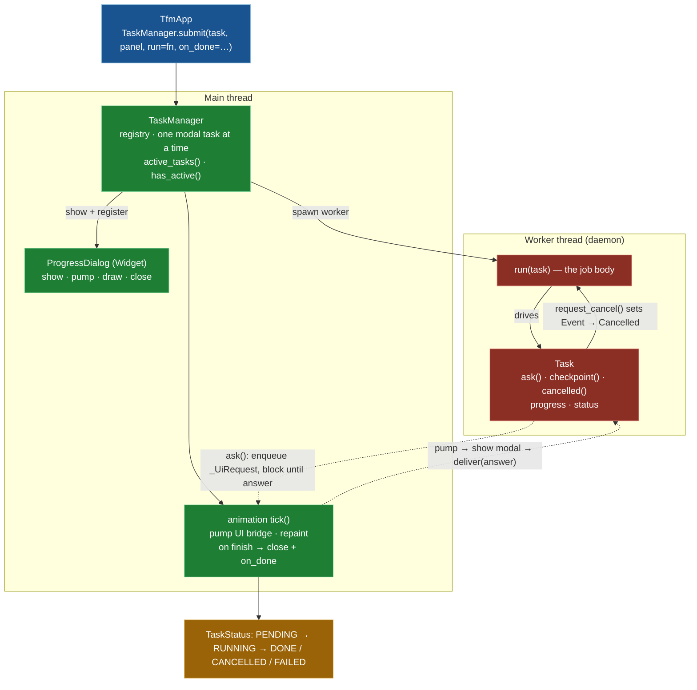

# Task Framework Implementation

## Overview

The task framework (`tfm_task.py`) runs long operations — file copy/move/delete, archive create/extract, directory-diff content comparison — on a background thread while the UI stays responsive, without letting worker code touch the UI directly.

A **task** is an ordinary `run(task)` function handed to `TaskManager.submit()`. The manager shows a modal `ProgressDialog`, spawns one worker thread, and services the task's UI bridge on each animation tick. From the worker the job body can:

- report progress through `task.progress` (a `ProgressManager`),
- request a modal dialog and block for the answer via `task.ask(...)`, and
- cooperatively cancel via `task.checkpoint()` / `task.cancelled()`.

The worker **never** calls into the panel or any widget itself — every UI interaction is marshalled to the main thread. This replaced the pre-PuiKit-port `BaseTask` / `FileOperationTask` state-machine design; there is no per-operation state machine any more, just a linear worker plus a small status enum.

## Architecture



## `Task`

A `Task` is the handle shared between the worker thread and the main thread.

| Member | Called on | Purpose |
|---|---|---|
| `progress` | both | A `ProgressManager` the worker drives and the dialog reads |
| `status` | main | Current `TaskStatus` (see below) |
| `counted` | both | Items seen so far during the pre-total counting phase (display only) |
| `result` / `error` | both | The worker's return value / the exception it raised, if any |
| `ask(show_fn, *, headless)` | worker | Show a modal via `show_fn(panel, deliver)` on the main thread and **block** until it delivers an answer; raises `Cancelled` if cancelled while waiting. Returns `headless` without prompting in synchronous mode. |
| `checkpoint()` | worker | Raise `Cancelled` if cancellation was requested. Call between units of work (per file / per chunk). |
| `cancelled()` | worker | Non-raising check of the cancel flag |
| `request_cancel()` | main | Set the cooperative cancel flag; a blocked `ask()` wakes within `_WAIT_TICK` (50 ms) and unwinds |

Internally the cancel flag is a `threading.Event` and pending UI requests sit on a `queue.Queue` of `_UiRequest`. See [Task Cancellation](TASK_CANCELLATION_IMPLEMENTATION.md) for the full cancellation model.

### `TaskStatus`

```
PENDING → RUNNING → DONE | CANCELLED | FAILED
```

`PENDING` (submitted, worker not started) → `RUNNING` (worker active) → one terminal state: `DONE` (finished normally), `CANCELLED` (cancelled before or during the run), or `FAILED` (the worker raised an unexpected exception).

## `TaskManager`

One instance per app (`TfmApp.tasks`). It is the registry of live tasks and the main-thread pump.

- `active_tasks()` / `has_active()` — which tasks are `PENDING` or `RUNNING` (the app checks this to block conflicting actions).
- `submit(task, panel, *, run, on_done=None, z=70, background=True)` — run `run(task)`:
  - **Background mode (default):** show a `ProgressDialog`, set the task `RUNNING`, spawn a daemon worker thread that runs `run(task)` (recording `result` / `error`), and register an animation `tick()` callback. Each frame the tick pumps the UI bridge and repaints; when the worker finishes it closes the dialog, finalises status, and calls `on_done(result)` on the main thread.
  - **Synchronous mode (`background=False`, used by tests):** mark the task headless, run `run(task)` inline (so `ask()` resolves to its headless default and no dialog appears), finalise, and call `on_done` immediately.

On completion `TaskStatus` is set from the outcome — `FAILED` if the worker raised, `CANCELLED` if it was cancelled or returned a `cancelled` result, otherwise `DONE` — and the task is removed from the registry.

Today the manager runs **one modal task at a time**; the shape (a registry plus a generic dialog) is deliberately left open for background / queued execution and a task-management UI later.

## `ProgressDialog`

A generic modal progress surface (a PuiKit `Widget`) that renders purely from `task.title` and `task.progress`, so every task type reuses it. It shows three phases:

- **Preparing** — a `BusyIndicator` and `Preparing… (N items)` while the operation is still counting (no total yet).
- **Running** — a determinate primary `ProgressBar` (items done / total), the current item name, and a secondary byte bar shown only while the current file reports a byte total (large / remote copies).
- **Cancelling** — a `Cancelling…` line once cancellation is confirmed, until the worker unwinds.

It is modal: `handle_event` swallows all input, so while a task runs the rest of the app is inert. `Esc` opens a confirm box; confirming calls `task.request_cancel()`.

## The UI bridge (`ask` / `_UiRequest` / `pump`)

The bridge is how a worker safely drives a modal:

1. The worker calls `task.ask(show_fn, headless=…)`, which enqueues a `_UiRequest` and blocks on its event.
2. On the next main-thread tick, `ProgressDialog.pump()` pops **one** request and calls `show_fn(panel, deliver)`, which pushes the modal.
3. When the user answers, the widget calls `deliver(answer)`, which unblocks the worker's `ask()` with that value.

Only one request is serviced at a time — the worker blocks on the answer before it can post the next — so prompts (e.g. per-file copy conflicts) appear sequentially.

## Example: a file operation as a task

`FileOperationService` (see [File Operations Architecture](FILE_OPERATIONS_ARCHITECTURE.md)) builds and submits a task like this:

```python
task = Task("Copy…", config=self.config, kind="copy")
task.progress.start_operation("copy", 0, description="")

def run(task: Task) -> dict:
    return self._run(task, "copy", targets, dest_dir, panel, log, z)

self.tasks.submit(task, panel, run=run, on_done=on_complete, z=z, background=background)
```

The `run` body resolves conflicts (via `task.ask`), counts work (updating `task.progress`), then executes each target, calling `task.checkpoint()` between them. A `Cancelled` exception unwinds `run` into a clean partial-result dict.

## Implementation files

- `src/tfm_task.py` — `Task`, `TaskStatus`, `Cancelled`, `_UiRequest`, `TaskManager`, `ProgressDialog`
- `src/tfm_progress_manager.py` — `ProgressManager` (the per-task progress model)
- `src/tfm_file_operations.py` — the first heavy user of the framework

## Related documentation

- [Task Cancellation](TASK_CANCELLATION_IMPLEMENTATION.md)
- [File Operations Architecture](FILE_OPERATIONS_ARCHITECTURE.md)
- [Progress Manager System](PROGRESS_MANAGER_SYSTEM.md)
