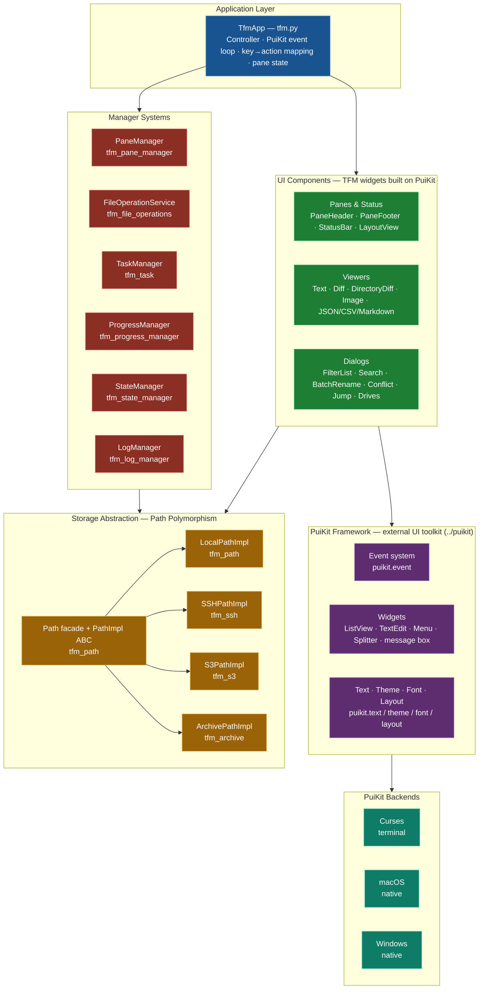

# TFM Application Overview

## Current Version: 0.99

TFM (Terminal File Manager) is a sophisticated terminal-based file manager built with Python's curses library. It provides a dual-pane interface with comprehensive file operations, cloud storage integration, and extensive customization capabilities.

## Core Architecture



### Design principles

TFM's UI is assembled from small, reusable components, each owning one aspect of
the interface. The principles that recur across them:

- **Modularity** — each feature lives in its own module (`src/tfm_*.py`).
- **Consistency** — uniform keyboard navigation and behavior across every dialog
  and pane.
- **Reusability** — the same component serves multiple contexts: the searchable
  list picker backs favorites, drives, programs, and the jump dialog; the same
  `FilePane` widget renders both real directories and virtual (search-results)
  listings.
- **Manager pattern** — specialized managers isolate concerns: `PaneManager`
  (dual-pane state and navigation), `FileOperationService` (copy / move / delete
  / rename), `TaskManager` (threaded work), `ProgressManager`, `StateManager`,
  and `LogManager`.
- **Extensibility** — new dialogs, viewers, and storage backends slot into the
  existing seams (the `Path` polymorphism and PuiKit widget layers shown above).

### Component groups

The architecture diagram above shows how the pieces fit together; the full
per-module inventory lives in [PROJECT_STRUCTURE.md](PROJECT_STRUCTURE.md). The
major groups are:

- **Dual-pane model** — `PaneManager` tracks the active pane, per-pane selection,
  sort/filter state, and directory navigation, while `FilePane` renders one pane
  (real or virtual). Cross-pane copy/move and directory comparison fall out of
  this model naturally.
- **Reusable dialogs & bars** — a searchable list picker, scrollable text/info
  dialogs, a progressive (threaded) filename/content search dialog, batch rename,
  single-line input, and status-bar quick choices, all built on PuiKit widgets.
- **Viewers** — text (with syntax highlighting), diff, directory-diff, image, and
  structured (JSON/CSV/Markdown) content.
- **Storage abstraction** — a single `Path` facade over local, S3, SSH/SFTP, and
  archive backends, so every file operation works uniformly across them.
- **Integration & extensions** — external-program execution and archive
  create/extract (ZIP, TAR.GZ, TGZ).

## Key Features

### File Management
- **Dual Pane Interface**: Left and right panes for efficient file operations
- **Comprehensive Operations**: Copy, move, delete, rename, create files and directories
- **Batch Operations**: Multi-selection with space bar, regex-based batch renaming
- **Archive Support**: Create and extract ZIP, TAR.GZ, TGZ archives
- **Safety Features**: Confirmation dialogs, conflict resolution, permission checks

### Navigation and Search
- **Smart Navigation**: Arrow keys, Tab switching, directory history
- **Incremental Search**: Real-time filtering as you type
- **Threaded Search**: Non-blocking filename and content search
- **Pattern Filtering**: fnmatch patterns (*.py, test_*, etc.)
- **Jump Dialog**: Intelligent directory scanning with search
- **Favorite Directories**: Customizable bookmarks with quick access

### Text Handling
- **Built-in Text Viewer**: Syntax highlighting for 20+ file formats
- **External Editor Integration**: Configurable text editor support
- **Encoding Support**: UTF-8, Latin-1, CP1252 with automatic detection
- **Search in Files**: Find functionality within viewed text files

### Cloud Storage Integration
- **AWS S3 Support**: Full S3 integration with s3:// URI support
- **Seamless Operations**: All file operations work with S3 objects
- **Intelligent Caching**: TTL-based caching for optimal performance
- **Virtual Directories**: S3 prefix-based directory simulation
- **Mixed Operations**: Copy/move between local and S3 storage

### System Integration
- **Sub-shell Mode**: Environment variables for current state access
- **External Programs**: Configurable external command integration
- **VSCode Integration**: Direct directory and file opening
- **Beyond Compare Integration**: File and directory comparison

### Customization
- **Configuration System**: Comprehensive Python-based configuration
- **Key Bindings**: Fully customizable keyboard shortcuts
- **Color Schemes**: Dark/Light themes with runtime switching
- **Progress Animations**: Configurable animation patterns
- **Behavior Settings**: Confirmations, display options, performance tuning

## Command Line Interface

### Basic Usage
```bash
python3 tfm.py                    # Start with default settings
tfm                               # If installed via pip
```

### Directory Specification
```bash
python3 tfm.py --left /projects --right /documents
python3 tfm.py --left . --right ..
```

### Color Testing
TFM includes comprehensive color support with multiple color schemes.

## Configuration System

### Configuration File
- **Location**: `~/.tfm/config.py`
- **Template**: `src/_config.py`
- **Auto-creation**: Generated from template on first run
- **Live Validation**: Error reporting with fallback to defaults

### Configurable Settings
- **Display**: Color schemes, pane ratios, hidden files
- **Behavior**: Confirmations, sorting, file operations
- **Performance**: Search limits, caching, animation speed
- **Key Bindings**: Complete keyboard customization
- **Directories**: Startup paths, favorites, history limits
- **Programs**: External command integration

## Development Architecture

### Modular Design
- **Component-based**: Each feature in separate module
- **Dialog System**: Reusable UI components
- **Manager Pattern**: Specialized managers for different concerns
- **Event-driven**: Key binding system with configurable actions

### Error Handling
- **Specific Exceptions**: Targeted exception handling
- **Graceful Degradation**: Fallback behavior for missing dependencies
- **User Feedback**: Clear error messages and recovery options

### Testing Framework
- **Unit Tests**: Component-level testing
- **Integration Tests**: Feature interaction testing
- **Demo Scripts**: Interactive feature demonstrations
- **Verification Scripts**: Quick feature validation

## Dependencies

### Required
- **Python 3.9+**: Core language requirement (3.13 supported)
- **curses**: Terminal UI library (built-in on Unix systems)

### Optional
- **pygments**: Enhanced syntax highlighting
- **boto3**: AWS S3 support
- **windows-curses**: Windows terminal support

## Platform Support
- **macOS**: Full support with native terminal
- **Linux**: Full support with standard terminals
- **Windows**: Supported with Windows Terminal or compatible terminals

## Performance Characteristics

### Optimizations
- **Threaded Operations**: Non-blocking search and file operations
- **Intelligent Caching**: S3 and remote operation caching
- **Lazy Loading**: On-demand resource loading
- **Memory Management**: Configurable limits for large operations

### Scalability
- **Large Directories**: Efficient handling of thousands of files
- **Remote Storage**: Optimized S3 operations with caching
- **Search Performance**: Configurable result limits and threading
- **Memory Usage**: Bounded memory consumption with cleanup

## Security Considerations

### File Operations
- **Permission Checks**: Validates file system permissions
- **Confirmation Dialogs**: User confirmation for destructive operations
- **Path Validation**: Prevents directory traversal attacks

### Cloud Integration
- **AWS Credentials**: Uses standard AWS credential chain
- **Secure Connections**: HTTPS for all S3 operations
- **Access Control**: Respects S3 bucket policies and IAM permissions

## Future Extensibility

### Plugin Architecture
- **External Programs**: Framework for custom tool integration
- **Dialog System**: Extensible UI component system
- **Path System**: Pluggable storage backend support

### Integration Points
- **Configuration**: Python-based configuration for flexibility
- **Key Bindings**: Programmable keyboard shortcuts
- **Color Schemes**: Customizable appearance system
- **Progress System**: Extensible progress tracking

This overview provides a comprehensive understanding of TFM's current architecture, capabilities, and design principles as of version 0.99.